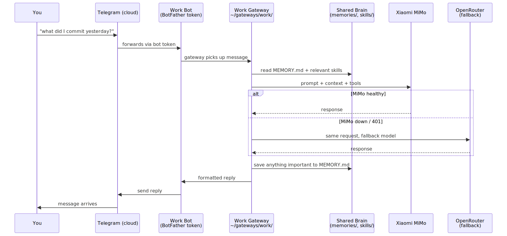
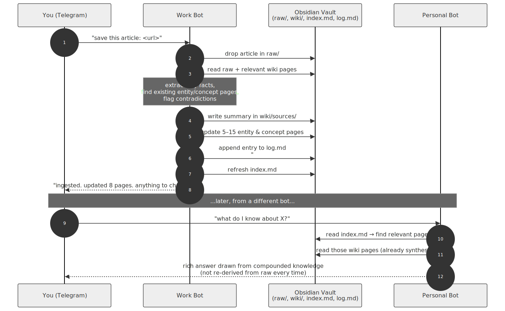
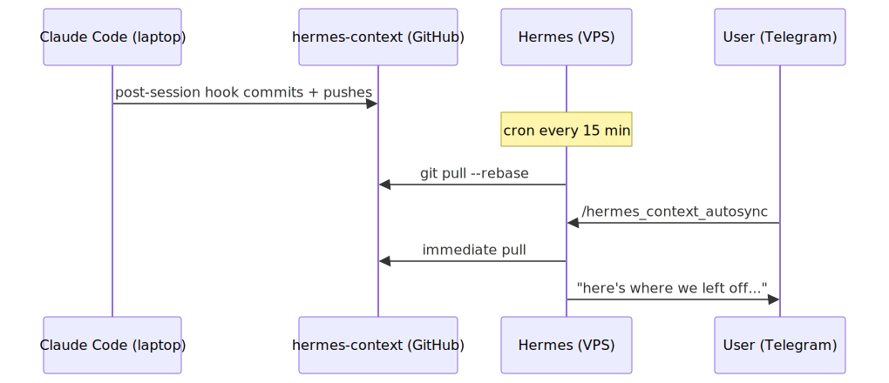

<div align="center">

# Hermes Agent — Dual Telegram Bot Setup with a Shared Brain

**Run two or multiple Telegram bots on a VPS that share the same memory, the same skills, and the same Obsidian vault — but speak with different voices.**
**One for work. One for personal life. One brain.**

[](https://github.com/NousResearch/hermes-agent)
[](https://www.hostinger.com/ph/vps/docker/hermes-agent)
[](https://t.me/BotFather)
[](LICENSE)

[**Quickstart**](#quickstart-tldr) · [**Why this repo**](#why-this-guide-exists) · [**Step-by-step**](#part-1-spin-up-the-vps-with-hostingers-one-click-install) · [**Add Nth bot**](#310-adding-a-third-or-fourth-or-nth-bot) · [**Architecture**](#architecture-diagrams) · [**Troubleshooting**](#troubleshooting)

</div>

---

> **Who this is for:** complete beginners. If you've never SSH'd into a server, never deployed a bot, never edited a YAML file — you're in the right place. Every command has a one-line plain-English explanation. Estimated time: **1–2 hours**, half a Saturday.
>
> **What you'll have at the end:** two Telegram bots that text you back, share everything they learn, write their own skills over time, and quietly keep themselves in sync with your laptop's coding sessions.
>
> If this saves you a Saturday, **star** the repo so the next person can find it.

---

## Table of Contents

- [Quickstart (TL;DR)](#quickstart-tldr)
- [Why this guide exists](#why-this-guide-exists)
- [What is Hermes Agent?](#what-is-hermes-agent)
- [Hermes Agent vs. OpenClaw — why this guide picked Hermes](#hermes-agent-vs-openclaw--why-this-guide-picked-hermes)
- [Profiles vs. Dual Gateway — what's different here](#profiles-vs-dual-gateway--whats-different-here)
- [Why one container, many gateways (and not N Docker containers)](#why-one-container-many-gateways-and-not-n-docker-containers)
- [Prerequisites & Costs](#prerequisites--costs)
- [How it works (visual primer for first-timers)](#how-it-works-visual-primer-for-first-timers)
  - [What's a symlink? (and what exactly are we symlinking?)](#whats-a-symlink-and-what-exactly-are-we-symlinking)
  - [Host VM vs container vs persistent volume](#host-vm-vs-container-vs-persistent-volume)
  - [What happens when you send a Telegram message](#what-happens-when-you-send-a-telegram-message)
  - [The four kinds of "memory"](#the-four-kinds-of-memory)
  - [Plain-English glossary of the rest](#plain-english-glossary-of-the-rest)
- [Part 1: Spin up the VPS with Hostinger's One-Click Install](#part-1-spin-up-the-vps-with-hostingers-one-click-install)
- [Part 2: Connect Your First Telegram Bot](#part-2-connect-your-first-telegram-bot)
- [Part 3: The Multi-Gateway Pattern (the magic)](#part-3-the-multi-gateway-pattern-the-magic)
  - [3.10 Adding a third (or fourth, or Nth) bot](#310-adding-a-third-or-fourth-or-nth-bot)
  - [3.11 Choosing your pattern: full-share vs split-brain](#311-choosing-your-pattern-full-share-vs-split-brain)
  - [3.12 Cross-gateway handoff (`shared/handoff/`)](#312-cross-gateway-handoff-sharedhandoff)
  - [3.13 Set bot commands in @BotFather](#313-set-bot-commands-in-botfather-small-qol-win)
- [Part 4: OpenRouter API Setup](#part-4-openrouter-api-setup)
- [Part 5: Xiaomi MiMo (free / cheap inference)](#part-5-xiaomi-mimo-free--cheap-inference)
- [Part 6: Add an Obsidian Second Brain](#part-6-add-an-obsidian-second-brain)
  - [6.0 What is an Obsidian vault, in plain English?](#60-what-is-an-obsidian-vault-in-plain-english)
  - [6.4 Level it up: Karpathy's LLM Wiki pattern](#64-level-it-up-karpathys-llm-wiki-pattern)
- [Part 7: hermes-context — Sync with Claude Code on your laptop](#part-7-hermes-context--sync-with-claude-code-on-your-laptop)
- [Architecture Diagrams](#architecture-diagrams)
- [Real-Life Examples](#real-life-examples)
- [Troubleshooting](#troubleshooting)
- [Resources](#resources)

---

## Quickstart (TL;DR)

For people who already know the shape of all this. Beginners — skip this and start at [Part 1](#part-1-spin-up-the-vps-with-hostingers-one-click-install).

```bash
# 1. Click Deploy on https://www.hostinger.com/ph/vps/docker/hermes-agent (KVM 2)
# 2. SSH into the host VM
ssh root@<vps-ip>

# 3. Drop into the Hermes container
docker exec -it hermes-agent bash

# 4. Pick your bot names — the FIRST one is the "primary" (owns the real brain),
# every other one symlinks into it.
PRIMARY=work
EXTRA_BOTS=(personal coach finance)        # add as many as you want

# 5. Set up the gateway scaffolds (inside the container)
for gw in "$PRIMARY" "${EXTRA_BOTS[@]}"; do
  mkdir -p ~/gateways/"$gw" && cd ~/gateways/"$gw" && hermes setup
done

# 6. Symlink the shared brain into every extra gateway
for gw in "${EXTRA_BOTS[@]}"; do
  rm -rf ~/gateways/"$gw"/{memories,skills}
  ln -s ~/gateways/"$PRIMARY"/memories ~/gateways/"$gw"/memories
  ln -s ~/gateways/"$PRIMARY"/skills   ~/gateways/"$gw"/skills
done

# 7. Drop in run.sh + inject_config.py + per-gateway .env (this repo provides them)
cd ~/gateways && chmod +x run.sh && ./run.sh all
```

N bots. One shared brain. Persistent Docker volume keeps it safe across restarts. Done.

---

## Why this guide exists

Every Hermes tutorial out there shows you how to run **one** bot. The official docs walk you through `hermes profile create` if you want more, which gives you fully isolated brains.

But that's not what most of us actually want. **Most of us have one head and several voices** — a calm life-copilot for personal stuff, a direct technical operator for work, maybe a fitness coach, maybe a private CFO. We want every one of those bots to remember the same projects, learn from the same skills, and read the same notes. Only the personality should differ.

This repo is the exact setup, written for beginners, that gives you:

- A working Hermes Agent on a Hostinger VPS in **under 30 minutes** using their one-click installer
- **Two — or three, or N — Telegram bots** with different personalities sharing one memory and one skill library
- **OpenRouter + Xiaomi MiMo** with automatic fallback so you never get stuck on a dead model
- An **Obsidian vault** the bots can read and write to like a second brain
- A **`hermes-context` GitHub repo** that bridges your laptop's Claude Code sessions to your VPS bots

I've been running this for over a month. Migrated to Xiaomi MiMo for primary inference. Below is the **exact** setup, copy-pasteable.

---

## What is Hermes Agent?

[Hermes Agent](https://github.com/NousResearch/hermes-agent) is an open-source AI agent by [Nous Research](https://nousresearch.com/). Think of it as **a Linux assistant that lives in your computer or in a server you can talk to from anywhere** — Telegram, Discord, the terminal, scheduled cron jobs.

What makes it different from "just a chat bot":

| Feature    | What it means in plain English                                                                                                                                                     |
| ---------- | ---------------------------------------------------------------------------------------------------------------------------------------------------------------------------------- |
| **Tools**  | It can read/write files, run shell commands, search the web, fetch URLs, and call MCP servers (a way for AI to use external apps like Gmail or Calendar).                          |
| **Memory** | Important things you tell it get saved to a `MEMORY.md` file. Full sessions land in a local SQLite database.                                                                       |
| **Skills** | Self-written markdown "recipes" the agent creates after solving something tricky, so next time it doesn't start from zero. After a week of use you'll have a small custom library. |
| **BYOM**   | Bring your own model. OpenRouter, Anthropic, OpenAI, Xiaomi MiMo, Z.AI, MiniMax, local models via Ollama. Configure once; Hermes routes the calls.                                 |

Their docs at [hermes-agent.nousresearch.com](https://hermes-agent.nousresearch.com/) are excellent. Read them after this guide for anything I gloss over.

---

## Hermes Agent vs. OpenClaw — why this guide picked Hermes

If you've been agent-curious for more than a weekend, you've heard of **[OpenClaw](https://github.com/openclaw/openclaw)** — Peter Steinberger's "personal AI assistant, the lobster way," shipped November 2025. It's good. It's the reason a lot of people first felt "oh, I can run my own agent." Hermes Agent ([NousResearch/hermes-agent](https://github.com/NousResearch/hermes-agent), 135k stars) shipped February 2026 and chose a different bet:

> **The Agent That Grows With You.** — that's the Hermes tagline, and it's not marketing fluff. It's the architecture.

OpenClaw is **gateway-first**: wide channel coverage, broad integrations, low setup friction, reactive tool use. Hermes is **agent-first**: every successful task gets distilled into a reusable skill, persistent memory accumulates across sessions, and the agent you have at week 4 is meaningfully better than the one you booted on day 1.



### Side-by-side tradeoffs

|                           | **OpenClaw**                                        | **Hermes Agent**                                                     |
| ------------------------- | --------------------------------------------------- | -------------------------------------------------------------------- |
| **Bet**                   | Breadth. Reach every channel, integrate every tool. | Depth. Compound knowledge across sessions.                           |
| **Persistent memory**     | Notes/recall, no automatic skill formation          | `MEMORY.md` + auto-generated `skills/` from solved problems          |
| **Self-improvement**      | None native — you copy patterns by hand             | Skills extracted, refined, and reused across runs                    |
| **Channels**              | Many out of the box (broad)                         | Telegram, Discord, Slack, WhatsApp, Signal, Email, CLI — and more    |
| **Multi-agent**           | First-class — multiple personas across channels     | Possible via multi-gateway (this guide's whole topic)                |
| **Sandboxing**            | Lighter — mostly local                              | **Five backends**: local, Docker, SSH, Singularity, Modal            |
| **Scheduled automations** | Add-on territory                                    | Native — natural-language cron, runs unattended through the gateway  |
| **Web/browser control**   | Tool-level                                          | Built-in: web search, browser automation, vision, image gen, TTS     |
| **Subagent delegation**   | Limited                                             | Isolated subagents w/ own conversations, terminals, RPC scripts      |
| **Migration**             | —                                                   | Hermes setup wizard auto-detects `~/.openclaw/` and imports it       |
| **Maturity signal**       | Earlier mover, larger integration catalog           | 135 stars in <3 months, faster release cadence, Nous Research-backed |

### The full Hermes feature list (for the skim-readers)

Straight from [hermes-agent.nousresearch.com](https://hermes-agent.nousresearch.com/):

- **Lives where you do** — Telegram, Discord, Slack, WhatsApp, Signal, Email, CLI, and a growing list of platforms. Start on one, pick up on another.
- **Grows the longer it runs** — persistent memory and auto-generated skills. Learns your projects and never forgets how it solved a problem.
- **Scheduled automations** — natural-language cron for reports, backups, and briefings. Runs unattended through the gateway.
- **Delegates & parallelizes** — isolated subagents with their own conversations, terminals, and Python RPC scripts. Zero-context-cost pipelines.
- **Real sandboxing** — five backends: local, Docker, SSH, Singularity, Modal. Container hardening and namespace isolation.
- **Full web & browser control** — web search, browser automation, vision, image generation, text-to-speech, multi-model reasoning.

---

## Profiles vs. Multi-Gateway — three ways to share (or not)

There are **three patterns** for running multiple Hermes bots. This guide focuses on the multi-gateway ones (full-share and split-brain) because profiles are well-documented upstream. Pick the row that matches your situation:

|                      | **Profiles** (official)             | **Full-Share Multi-Gateway**           | **Split-Brain Multi-Gateway**                          |
| -------------------- | ----------------------------------- | -------------------------------------- | ------------------------------------------------------ |
| Memory (`memories/`) | Isolated per profile                | **Shared** (symlinked)                 | **Isolated** per bot                                   |
| Skills (`skills/`)   | Isolated per profile                | **Shared** (symlinked)                 | **Shared** (symlinked)                                 |
| Sessions             | Isolated per profile                | Isolated per bot                       | Isolated per bot                                       |
| Obsidian vault       | n/a                                 | **Shared**                             | **Shared** (the durable layer)                         |
| System prompt        | Same default                        | Different per bot                      | Different per bot                                      |
| Bot tokens           | One per profile                     | One per bot                            | One per bot                                            |
| Cross-bot recall     | None                                | **Yes — automatic**                    | Only via Obsidian (deliberate)                         |
| Leak risk            | None                                | Personal facts can surface in work bot | Low — facts only flow when you write them to the vault |
| Best for             | Strict tenant isolation, compliance | One head, many voices, leakage is fine | One head, many voices, **leakage is NOT fine**         |

> **Rule of thumb:**
>
> - Freelancer juggling clients who must never see each other's data → **profiles**.
> - One builder, casual home + work, doesn't mind a personal fact occasionally surfacing in the work bot → **full-share** (the default in this guide).
> - One builder who has things the work bot should genuinely never repeat (medical, family, finances) → **split-brain** ([§3.11](#311-choosing-your-pattern-full-share-vs-split-brain)). Skills still compound across all bots; only deliberate, vault-stored knowledge crosses over.

---

## Why one container, many gateways (and not N Docker containers)

Reasonable question: if Hermes already runs in a Docker container on the Hostinger 1-click, why not just spin up two containers — `hermes-work`, `hermes-personal` — and call it a day? Tried it. Don't.

The whole point of this guide is **one shared brain, many voices**. Containers are a unit of *isolation*. Voices that share a brain don't want isolation between them — they want the opposite. So you separate at the right layer: **one container holds the brain, N gateway processes inside it present different faces to Telegram.**

Every concern stacks the same direction:

|                                | **One container, N gateways (this guide)**                                                                                                              | **N containers, one gateway each**                                                                                                                                                                              |
| ------------------------------ | ------------------------------------------------------------------------------------------------------------------------------------------------------- | --------------------------------------------------------------------------------------------------------------------------------------------------------------------------------------------------------------- |
| **Shared brain**               | A symlink inside the same filesystem. One inode, every gateway process sees the exact same bytes the moment they're written.                            | A bind-mounted volume across containers. Two processes from two containers writing to the same SQLite/flat-file `memories/` race each other; nothing in Hermes coordinates locks across containers. Eventually you corrupt a memory file and don't notice for a week. |
| **RAM**                        | Gateway processes are ~50–100 MB each. Four bots ≈ 400 MB total. Comfortable on KVM 2's 8 GB with room left for MCP servers and the model client.       | A full Hermes container idles around 1–2 GB once Python, MCP servers, and the model client are loaded. Four containers ≈ 4–8 GB just sitting there. KVM 2 starts swapping; you're forced to KVM 4 before adding a single skill. |
| **Hostinger upgrade path**     | The 1-click template manages exactly one container (`hermes-agent`). Restart, upgrade, rollback — already wired up.                                     | Hostinger's template doesn't know about your extra containers. Their upgrades touch only the one they shipped. You inherit lifecycle for the rest — base image bumps, Python version drift, MCP version drift, all of it. |
| **MCP servers & model client** | One set of MCP processes, one OpenRouter/MiMo client pool, one cron daemon. Shared across every gateway.                                                | Every container starts its own MCP stack and opens its own model connections. Multiplied API session count, multiplied warm-up time, multiplied debug surface when something misbehaves.                       |
| **Cron / scheduled skills**    | One crontab. A single 6 AM "morning brief" task can read memories the work bot wrote yesterday and DM the personal bot the result.                      | Cron lives where? Pick a container. Now that container needs read access to the others' state, which means more bind mounts, which means we're back to the corruption problem in row 1.                        |
| **Cross-bot handoff**          | Drop a file into `~/gateways/shared/handoff/` ([§3.12](#312-cross-gateway-handoff-sharedhandoff)) — every gateway sees it instantly, same filesystem.    | Requires a shared bind mount plus filesystem-event coordination across container boundaries. Doable, fragile, and you'll debug it at 11 PM the first time inotify drops an event.                               |
| **Operational surface**        | One `run.sh`, one log stream, one `tmux`/systemd unit. Adding a fifth bot is one more folder + symlinks + 60 seconds.                                   | N `docker-compose` services (or N `docker run` invocations), N log streams, N restart policies, N env files to keep in sync. Adding a fifth bot is a config change everywhere.                                  |
| **Backups**                    | `docker cp hermes-agent:/<volume>/skills ./skills-backup` and you have everything. One volume to snapshot.                                              | N volumes, possibly across N containers, each with partial state. You can do it; you just have to remember which container owns which authoritative copy.                                                       |

A few honest cases where extra containers *do* make sense — and none of them apply to "I want a work bot and a personal bot":

- **Hard tenant isolation** (multiple paying clients, compliance boundary, can't-leak-ever data). Use **profiles** for this, not extra containers — that's exactly what the upstream profile system was built for. See the table at [Profiles vs. Multi-Gateway](#profiles-vs-multi-gateway--three-ways-to-share-or-not).
- **Different Hermes versions side-by-side** (you're testing an upgrade). Spin up a second container temporarily, point it at a copy of the volume, throw it away when you're done. Not a permanent setup.
- **Genuinely different runtimes** (one bot needs a GPU passthrough, another doesn't). Different problem, different shape.

For the "one builder, two-to-five voices, one shared brain" case this guide is built around, the bare-VPS-style pattern *inside* the existing container is the cheap, durable, boring choice. And boring is what you want from infra you don't think about.

---

## Prerequisites & Costs

Realistic, no surprises:

| Item                                                                                             | Cost                                                                       | Notes                                                                                       |
| ------------------------------------------------------------------------------------------------ | -------------------------------------------------------------------------- | ------------------------------------------------------------------------------------------- |
| **Hostinger VPS** ([Hermes Agent 1-click](https://www.hostinger.com/ph/vps/docker/hermes-agent)) | **₱995.68/mo** (renews ₱819/mo) — about **$18–20 USD** (as of May 6, 2026) | KVM 2 default: 2 vCPU, 8 GB RAM, 100 GB NVMe, 8 TB bandwidth. Comfortable for 2–4 gateways. |
| Domain                                                                                           | Optional                                                                   | Only if you want public webhooks. SSH-only setup needs none.                                |
| **Telegram bots**                                                                                | Free                                                                       | Created via [@BotFather](https://t.me/BotFather). One per voice.                            |
| **OpenRouter credits**                                                                           | $5 minimum top-up                                                          | Pay-as-you-go. ~$2–5/month for moderate use.                                                |
| Xiaomi MiMo                                                                                      | Free with Orbit, otherwise ~free at Token Plan tier                        | See [§5.1](#51-the-xiaomi-mimo-orbit-program-recommended-path--free-tokens).                |
| Obsidian                                                                                         | Free                                                                       | Local-first notes app. Optional but transformative.                                         |
| **Time to set up**                                                                               | **30–90 minutes**                                                          | The 1-click cuts the original 1–2 hour estimate in half.                                    |

You also need:

- **An SSH client.** macOS/Linux already have one. Windows: install [Termius](https://termius.com/) or use the built-in `ssh` in PowerShell.
- **A Telegram account.**
- **A GitHub account** (for the optional `hermes-context` repo).

---

## How it works (visual primer for first-timers)

Before you start clicking and copy-pasting, here are four ideas this guide leans on hard. Skim the diagrams once. If something later feels confusing, scroll back here.

> **You don't need to understand all of this to follow the steps.** The commands work as written. This section is here for the moment you ask _"wait, what is this actually doing?"_ — usually around Part 3.

### What's a symlink? (and what exactly are we symlinking?)

A **symlink** (short for _symbolic link_) is a Linux pointer that makes one folder _look_ like it's in two places at once. It's not a copy — both names lead to the **same actual files on disk**. Edit through either name, both reflect the change.

Picture two filing cabinets:

```
WITHOUT a symlink (the regular way)
────────────────────────────────────────
~/gateways/work/                   ~/gateways/personal/
├── memories/   (real folder)    ├── memories/   (a SECOND real folder)
│   └── MEMORY.md                │   └── MEMORY.md   (different file!)
└── skills/                      └── skills/
    └── docker.md                      └── (empty — you'd have to copy)

  ↑ Two folders. Two MEMORY.md files. Two copies of every skill.
  ↑ "Remember I prefer pnpm" → only the work bot remembers.

WITH a symlink (this guide's pattern)
────────────────────────────────────────
~/gateways/work/                   ~/gateways/personal/
├── memories/   (real folder)    ├── memories/   → ../work/memories/
│   └── MEMORY.md                │     (a pointer, NOT a copy)
└── skills/                      └── skills/     → ../work/skills/
    └── docker.md                        (a pointer, NOT a copy)

  ↑ One real folder. The "personal" name is just a shortcut to it.
  ↑ "Remember I prefer pnpm" → ONE MEMORY.md updated → BOTH bots see it.
```

The same idea as a diagram:



**What we symlink in this guide:**

| Folder                | Symlinked?                                                                                        | Why                                                                             |
| --------------------- | ------------------------------------------------------------------------------------------------- | ------------------------------------------------------------------------------- |
| `memories/`           | Yes in full-share mode, no in [split-brain](#311-choosing-your-pattern-full-share-vs-split-brain) | "Did I tell the work bot about X?" should also work from the personal bot.      |
| `skills/`             | Yes — **always**                                                                                  | A recipe written by one bot is procedural knowledge — every bot should benefit. |
| `sessions/`           | No, never                                                                                         | Conversations stay private to the bot they happened in.                         |
| `config.yaml`, `.env` | No, never                                                                                         | Each bot needs its own bot token, system prompt, and personality settings.      |

**Verifying a symlink looks right:**

```bash
ls -la ~/gateways/personal/
# A symlink shows an arrow:
# lrwxrwxrwx 1 root root  35 May  6 09:11 memories -> /root/gateways/work/memories
# drwxr-xr-x 2 root root  64 May  6 09:10 sessions       (real folder, no arrow)
```

The `l` at the very start of the line means "this is a link." If you see `d` (directory), it's a real folder, not a symlink — fix it before continuing.

### Host VM vs container vs persistent volume

If you used the Hostinger 1-click ([Part 1](#part-1-spin-up-the-vps-with-hostingers-one-click-install)), Hermes runs _inside a Docker container_, which runs _inside the VPS Hostinger gave you_. Three layers, each with a different shell, different filesystem, and different rules. Mixing them up is the #1 source of "wait, where did my files go?" confusion.



**The three "places" you can be working in:**

| Where you are            | How you got there                                     | What you can see                                                  |
| ------------------------ | ----------------------------------------------------- | ----------------------------------------------------------------- |
| **Your laptop**          | (you live here)                                       | Your local files, Obsidian, Claude Code                           |
| **Host VM**              | `ssh root@<vps-ip>`                                   | Docker daemon, container logs, the host filesystem (mostly empty) |
| **Inside the container** | `docker exec -it hermes-agent bash` (run on the host) | The `hermes` CLI, your gateways folder, the persistent volume     |

**The persistent volume is the green box.** Anything _inside the green box_ survives `docker restart`. Anything _inside the container but outside the volume_ (like `apt install` packages, files in `/tmp`) gets wiped on restart. That's why this guide always tells you to put `~/gateways/`, your hermes-context clone, and your Obsidian vault under the persistent path.

### What happens when you send a Telegram message

Useful to see end-to-end the first time. This is the work bot, full-share mode, MiMo as the primary model:



The same flow happens for the personal bot — but because `Brain` is symlinked, both bots are reading and writing the _same_ `memories/` and `skills/`. That's the whole magic in one diagram.

### The four kinds of "memory"

Hermes has more than one place it remembers things, and they behave differently. Conflating them is the second-most-common source of confusion (the first is host-vs-container).



| Type               | What it is                                                                                                                     | Lifetime                                       | Sharing pattern in this guide                                          |
| ------------------ | ------------------------------------------------------------------------------------------------------------------------------ | ---------------------------------------------- | ---------------------------------------------------------------------- |
| **memories/**      | A markdown file (`MEMORY.md`) the agent appends to whenever something seems worth remembering. Mostly automatic, mostly noisy. | Until you delete it                            | **Shared** in full-share mode · **Isolated** in split-brain mode       |
| **skills/**        | Markdown recipes the agent writes after solving a problem. Procedural ("how to deploy n8n"), not personal.                     | Until you delete it                            | **Always shared** via symlink — the one folder every bot benefits from |
| **sessions/**      | A SQLite database with full conversation transcripts. Searchable, replayable, big.                                             | Until you delete it                            | **Never shared** — your conversations stay where they happened         |
| **Obsidian vault** | A folder of `.md` files **you** also see in Obsidian on your laptop. The canon — what you've decided is durable.               | Until you delete it (and you can `git revert`) | **Shared via path** — one `OBSIDIAN_VAULT_PATH` in every `.env`        |

**Mental model:** `memories/` is what the agent scribbles on a napkin. `skills/` is the cookbook. `sessions/` is the diary. The **vault** is the binder you keep on the shelf — the only one _you_ curate, the only one that's truly yours.

### Plain-English glossary of the rest

Quick definitions for terms used elsewhere in this guide. Skim now, refer back when one of these surprises you.

| Term                         | Plain English                                                                                                                                                                                        | Where it shows up                                                    |
| ---------------------------- | ---------------------------------------------------------------------------------------------------------------------------------------------------------------------------------------------------- | -------------------------------------------------------------------- |
| **VPS**                      | A "virtual private server" — a slice of someone's real machine that behaves like your own Linux box.                                                                                                 | [Part 1](#part-1-spin-up-the-vps-with-hostingers-one-click-install)  |
| **KVM**                      | The kind of virtualization Hostinger uses — gives you a real Linux kernel, not just a sandboxed shell. Translation: _"this is a real computer for you, not a shared cubicle."_                       | [Prerequisites](#prerequisites--costs)                               |
| **SSH**                      | "Secure shell." A tool that opens a terminal on a remote computer over an encrypted connection. `ssh root@1.2.3.4` = "log in as `root` on that IP."                                                  | [§1.2](#12-ssh-into-the-vps-host)                                    |
| **Bot token**                | A long random string BotFather gives you. It's the password for _that one Telegram bot_. Anyone with it can send messages as your bot — treat it like a password.                                    | [§2.1](#21-create-a-bot-in-telegram)                                 |
| **API key**                  | Same idea, different service. A long string a model provider (OpenRouter, MiMo) gives you so they can identify and bill you. Goes in `.env`, never in code.                                          | [Part 4](#part-4-openrouter-api-setup)                               |
| **`.env` file**              | A plain-text file holding secrets and per-deployment knobs (`OPENROUTER_API_KEY=…`, `OBSIDIAN_VAULT_PATH=…`). Hermes reads it on startup. **Never commit it to git.**                                | [§3.5](#35-per-gateway-env-files)                                    |
| **`config.yaml`**            | The bot's _non-secret_ settings — which model, which fallback, which provider. Safe to commit. The token gets injected at runtime by `inject_config.py`.                                             | [§3.6](#36-the-launcher-runsh)                                       |
| **`chmod 600`**              | "Only the owner can read or write this file." We do this to `.env` files because they hold tokens. Anything else can be read by other users on the machine.                                          | [§3.5](#35-per-gateway-env-files)                                    |
| **Symlink**                  | See above — a folder/file alias. Lets two paths refer to the same actual data.                                                                                                                       | [Part 3](#part-3-the-multi-gateway-pattern-the-magic)                |
| **Container / Docker**       | A self-contained running copy of an app, packaged with everything it needs. The Hostinger 1-click is a Docker container holding Hermes.                                                              | [§1.3](#13-confirm-the-hermes-container-is-running)                  |
| **Persistent volume**        | A folder Docker keeps separate from the container so your data survives when the container itself is restarted/replaced.                                                                             | [§1.4](#14-find-the-persistent-volume-this-is-where-your-data-lives) |
| **`docker exec -it … bash`** | "Open an interactive shell inside the running container." This is how you get to where Hermes lives.                                                                                                 | [§1.5](#15-enter-the-container)                                      |
| **systemd**                  | Linux's built-in "make this thing start on boot and restart if it dies" service manager. We use it to keep `run.sh` running.                                                                         | [§3.8](#38-make-it-permanent)                                        |
| **tmux**                     | A terminal multiplexer — lets you start a long-running command in a "session" that survives even after you close your SSH window. Detach with `Ctrl+B` then `D`; re-attach later with `tmux attach`. | [§2.4](#24-run-it-as-a-service-survives-reboots)                     |
| **cron**                     | Linux's scheduler. "Run this command every 15 minutes / every Tuesday / every hour." We use it to keep the hermes-context repo synced.                                                               | [§7.4](#74-schedule-the-silent-sync)                                 |
| **Fallback provider**        | A second model/API that gets used automatically if the primary is down or rate-limited. In this guide: MiMo primary, OpenRouter fallback.                                                            | [§5.5](#55-why-mimo--openrouter-fallback)                            |
| **MCP server**               | "Model Context Protocol" — a standard way for AI agents to call external tools (Gmail, Calendar, Slack, …). Hermes can plug in MCP servers as new capabilities.                                      | [§"What is Hermes Agent?"](#what-is-hermes-agent)                    |
| **Gateway**                  | In this guide: one Hermes process attached to one Telegram bot. Two bots = two gateways. The "multi-gateway pattern" is many of these sharing a brain.                                               | [Part 3](#part-3-the-multi-gateway-pattern-the-magic)                |
| **Profile** (Hermes term)    | Hermes's official feature for fully isolated bots. Different from gateways: profiles wall off **everything**, gateways can choose what to share.                                                     | [§](#profiles-vs-multi-gateway--three-ways-to-share-or-not)          |
| **`git pull --rebase`**      | "Get the latest from GitHub, but lay any of my unpushed changes neatly on top of it instead of making a merge bubble." Cleaner history, same end state.                                              | [§7.3](#73-create-the-autosync-skill)                                |

---

## Part 1: Spin up the VPS with Hostinger's One-Click Install

Hostinger ships a **one-click Docker template for Hermes Agent**: [hostinger.com/ph/vps/docker/hermes-agent](https://www.hostinger.com/ph/vps/docker/hermes-agent). Click Deploy, pay, log in. You skip every step a normal install requires — Docker, Python, the `setup-hermes.sh` ceremony, all of it. Hermes comes up inside a container with a **persistent Docker volume** that survives restarts and template upgrades, which means **your skills, memories, sessions, and config are safe** as long as you don't blow the volume away.

This section is the new path. It replaces the old manual `git clone + setup-hermes.sh` walkthrough — that's now the [Manual install fallback](#manual-install-fallback) at the bottom.

### 1.1 Click Deploy

1. Go to **[hostinger.com/ph/vps/docker/hermes-agent](https://www.hostinger.com/ph/vps/docker/hermes-agent)**.
2. On the right-hand panel, the default plan is **KVM 2** — 2 vCPU, 8 GB RAM, 100 GB NVMe, 8 TB bandwidth, **₱549/mo (~$8–10 USD)** introductory. That's exactly what this guide assumes. If you'll run more than 4 gateways or heavy MCP integrations, bump up to KVM 4 instead.
3. Click the purple **Deploy** button.
4. Hostinger asks you to sign in / sign up, pick a billing cycle, and pay. Standard checkout flow.
5. After payment, Hostinger drops you into the VPS provisioning screen. Choose:
   - A **data center** close to you (lower latency to Telegram).
   - A **strong root password** — save in your password manager. Don't rely solely on Hostinger's emailed copy.
   - A **hostname** like `hermes` if it asks. Cosmetic.
6. Click **Continue / Finish**. Provisioning takes **2–4 minutes**. When it's done you get a server IP. Copy it.

> _What this does:_ Hostinger spins up a fresh KVM virtual machine with Docker pre-installed and a Hermes Agent container already running on it. Everything you'd otherwise do by hand — install Python, clone the repo, run `setup-hermes.sh`, configure systemd — is replaced by a running container with a mounted persistent volume.

### 1.2 SSH into the VPS host

Open a terminal on your laptop:

```bash
ssh root@<your-vps-ip>
```

Type `yes` when asked about the host fingerprint, then paste your root password.

> _What this does:_ Opens a remote shell on the **host VM** (the box Hostinger gave you). The Hermes Agent itself lives one level deeper, inside a Docker container running on this host. Almost everything in this guide happens **inside the container**, but you start at the host shell.

### 1.3 Confirm the Hermes container is running

```bash
docker ps
```

You should see a single running container with an image like `nousresearch/hermes-agent` or `hermes-agent` and a status of `Up X minutes (healthy)`. Note its **NAME** (left-most column) — likely `hermes-agent` or `hermes`. You'll use that name in the next step.

If the container is missing or in a `Restarting` loop:

```bash
docker ps -a              # show all containers, even stopped/crashed ones
docker logs <name> --tail=200
```

The logs almost always tell you what's missing (usually a model API key — fixable in [Part 4](#part-4-openrouter-api-setup)).

### 1.4 Find the persistent volume (this is where your data lives)

```bash
docker inspect <container-name> --format '{{json .Mounts}}' | jq
```

You'll see a JSON block. Look for the entry with `"Type": "volume"` and read the `Destination` field — that's the path **inside the container** where Hermes keeps its state (commonly `/root/.hermes`, `/data`, or `/app/data`). Whatever it is, **all the gateway folders we'll create later (`~/gateways/work`, etc.) must live underneath that path** so they survive restarts. The default container HOME is usually under that mount; the rest of this guide assumes it is.

> _Why this matters:_ Files written to non-mounted paths inside a Docker container disappear when the container restarts. The persistent volume is what makes Hermes self-improving over time — your skills accumulate, your memories persist, your conversations are recoverable.

### 1.5 Enter the container

From here on, "inside the box" means inside the Hermes container, not on the Hostinger host VM:

```bash
docker exec -it <container-name> bash
```

The prompt changes (often to something like `root@<container-id>:~#`). You're now inside the container. The `hermes` command is on PATH here, not on the host.

> _Tip:_ You'll be doing this a lot. Add a host-side alias once and forget it: `echo 'alias hermes-shell="docker exec -it hermes-agent bash"' >> ~/.bashrc && source ~/.bashrc`. Then just type `hermes-shell` to drop in.

### 1.6 Verify Hermes is alive (inside the container)

```bash
hermes --version
```

You should see a version number (e.g. `Hermes Agent 0.x.x`). If you get `command not found` here, the container image is malformed — open a Hostinger support ticket; this isn't something you should have to fix by hand.

### 1.7 Pick a model (first time)

Still inside the container:

```bash
hermes model
```

This opens an interactive picker. **Pick OpenRouter for now** and follow the prompts. We'll layer on Xiaomi MiMo as the primary later in [Part 5](#part-5-xiaomi-mimo-free--cheap-inference). You'll need an OpenRouter key first — see [Part 4](#part-4-openrouter-api-setup) if you want to set that up before continuing.

> _What this does:_ Tells Hermes which AI model to call when you message it. OpenRouter is one API key, hundreds of models — perfect default.

### 1.8 What survives a restart, what doesn't

The 1-click template's persistent volume covers:

- `skills/` (every recipe the agent has ever written)
- `memories/` (the `MEMORY.md` files)
- `sessions/` (your conversation history & SQLite DB)
- `config.yaml` per gateway
- `.env` per gateway (provided you put them under the mounted path — we will)
- Any cron jobs you register via `hermes -p <profile> cron add`

The volume **does not** cover:

- Anything outside the mounted path (system packages you `apt install` inside the container, files in `/tmp`, etc.).
- The host VM's filesystem outside the volume binding.

When you `docker restart hermes-agent` or Hostinger upgrades the template, all the items above stick around. That's the whole point of using their 1-click — the upgrade story is solved for you.

> _Don't `docker volume rm`._ Removing the named Docker volume Hostinger created **deletes every memory and skill the agent has accumulated.** If you do need to nuke and start over, back up `skills/` and `memories/` first by copying them to the host with `docker cp <container>:/<volume-path>/skills ./skills-backup`.

### Manual install fallback

If for some reason you can't or won't use the Hostinger 1-click — you're hosting elsewhere, the template was unavailable, you want bare metal — install Hermes manually on a fresh Ubuntu 24.04 box.

**Just running on your laptop/desktop? Read this first.**

If you're installing Hermes directly on your own computer (not on a remote VPS), the official quickstart is the simplest path of all — and most of this guide is overkill for that case:

→ **[hermes-agent.nousresearch.com/docs/user-guide/profiles](https://hermes-agent.nousresearch.com/docs/user-guide/profiles)**

> _Why this might be all you need:_ A lot of what this guide solves only matters when Hermes lives on a remote VPS that has to keep running while your laptop sleeps — persistent Docker volumes, restart-survival, cron across container reboots, dual-gateway symlinks for shared brain across personas. If everything sits on one machine and you're happy using Hermes's built-in **profiles** to separate contexts (work vs. personal vs. a client project), follow the upstream profiles guide and stop there. Come back to this README when you outgrow it — typically when you want the bot reachable while the laptop is closed, or you want one *shared* brain across multiple voices instead of isolated profile copies.

**Quick install (one-liner, recommended for VPS):**

```bash
curl -fsSL https://raw.githubusercontent.com/NousResearch/hermes-agent/main/scripts/install.sh | bash
```

> _What this does:_ Pulls the upstream installer, installs Python deps, clones Hermes into `~/.hermes/`, and puts the `hermes` CLI on your `$PATH`. Takes 2–3 minutes on a fresh KVM 2.

**Manual install (if you want to see every step):**

```bash
# Update the system & install dependencies
apt update && apt upgrade -y
apt install -y python3 python3-pip python3-venv git tmux curl

# Clone & install Hermes
git clone https://github.com/NousResearch/hermes-agent.git ~/.hermes/hermes-agent
cd ~/.hermes/hermes-agent
./setup-hermes.sh
```

Either path leaves you with the same result: the `hermes` command is global on the host. Run `hermes --version` to confirm, then `hermes model` and continue with [Part 2](#part-2-connect-your-first-telegram-bot).

> _Bare-metal mental model:_ When Hermes lives directly on the host (not in a container), every reference to "inside the container" in the rest of this guide just means "on the host shell." Skip the `docker exec` step, ignore the systemd unit needing `docker restart`, and the rest of the commands work as-is.

---

## Part 2: Connect Your First Telegram Bot

Before doing the multi-gateway dance, get **one** bot working end-to-end. If one bot works, two will work, and so will twenty.

> **Container note:** From here on, all `hermes …` commands run **inside** the Hermes container. If you're using the Hostinger 1-click, drop in with `docker exec -it hermes-agent bash` (or your `hermes-shell` alias from [§1.5](#15-enter-the-container)) before running anything in this section. Bare-metal users can ignore this — your shell is already in the right place.

### 2.1 Create a bot in Telegram

1. Open Telegram and start a chat with [**@BotFather**](https://t.me/BotFather).
2. Send `/newbot`.
3. Pick a display name (e.g., "Work Hermes") and a username ending in `bot` (e.g., `my_work_hermes_bot`).
4. BotFather replies with a **bot token** — a long string like `1234567890:AABBccDDeeFFggHHiiJJkkLLmmNNooPP`. **Copy it.** This is the password to your bot. Don't share it.
5. While you're here, message [**@userinfobot**](https://t.me/userinfobot) and send `/start`. It'll reply with **your Telegram user ID** (a number). Copy that too.

### 2.2 Tell Hermes about the bot

Back on the VPS:

```bash
hermes gateway setup
```

Paste the bot token when prompted. Paste your Telegram user ID. Done.

> _What this does:_ Saves the token in Hermes's config so it knows which bot to attach to and saves your user ID so the bot only listens to _you_ (not random strangers who find the bot).

### 2.3 Run it (test mode)

```bash
hermes gateway run
```

Open Telegram, message your new bot ("hello"), and watch it reply.

Press `Ctrl+C` to stop.

### 2.4 Run it as a service (survives reboots)

**On the Hostinger 1-click (Docker):** the container itself has `--restart unless-stopped` baked in by the template, so the gateway process inside it just needs to start when the container starts. Inside the container:

```bash
hermes gateway install                    # writes the in-container service file
hermes gateway run &                      # start it for this session
disown                                    # detach from your shell so it survives logout
```

For a more proper inside-container service, you can run the gateway under `tmux` (already installed in the template):

```bash
tmux new-session -d -s hermes 'hermes gateway run'
tmux ls                                   # confirm session 'hermes' exists
```

When the container restarts (or the host reboots), Docker will re-launch the container and you'll re-attach with `tmux attach -t hermes` from inside it. We'll replace this with a multi-gateway launcher in Part 3, so don't over-invest here.

**On bare-metal install:**

```bash
hermes gateway install
systemctl start hermes-gateway.service
systemctl enable hermes-gateway.service   # auto-start on reboot
systemctl status hermes-gateway.service
```

You now have **one** working bot. If this is all you wanted, you can stop here. Most people stop here. But the cool part is next.

---

## Part 3: The Multi-Gateway Pattern (the magic)

This is the section that makes this guide different from every other Hermes tutorial. **Two — or three, or five — Telegram bots, distinct personalities, one shared brain.**

The pattern below uses **two bots (work + personal)** as the worked example because that's the most common setup. Once it works, [§3.10](#310-adding-a-third-or-fourth-or-nth-bot) shows you how to add more bots in 60 seconds each. The same trick scales to N voices.

> **Container note (Hostinger 1-click users):** every command in this part runs **inside** the Hermes container. Drop in with `docker exec -it hermes-agent bash` first. The `~/gateways/` path used throughout sits inside the container's persistent Docker volume, so everything you create here survives container restarts and template upgrades. Confirm your `~` is on the persistent mount with `df -h ~` — the device should match the volume `Destination` you saw in [§1.4](#14-find-the-persistent-volume-this-is-where-your-data-lives). If `~` isn't on the volume, replace `~/gateways/` with the actual mount path (e.g. `/data/gateways/`) everywhere below.

> **Bare-VPS users (no Hermes installed yet):** if you're not on the Hostinger 1-click and you don't already have the `hermes` CLI on this box, install it first with the one-liner before doing anything in this part:
>
> ```bash
> curl -fsSL https://raw.githubusercontent.com/NousResearch/hermes-agent/main/scripts/install.sh | bash
> ```
>
> Confirm with `hermes --version`. Full bare-metal walkthrough (deps, manual clone, alternate paths) is in [§Manual install fallback](#manual-install-fallback). The rest of Part 3 then runs on your normal host shell — every "inside the container" instruction collapses to "on the host."

### 3.1 The directory layout

All gateways live under `~/gateways/`. **Pick one as the "primary"** — it owns the real `memories/` and `skills/` folders. Every other gateway symlinks into the primary. Throughout the rest of this guide the primary is `work` and the second bot is `personal`, but the names are yours to pick.

```
~/gateways/
├── run.sh                  # launcher script (this repo)
├── inject_config.py        # injects bot token at startup (this repo)
├── .env.example            # template (this repo)
│
├── work/                   # PRIMARY gateway — owns the real brain
│   ├── config.yaml
│   ├── .env                # work bot token + work system prompt
│   ├── memories/  ◄─── canonical (real folder)
│   ├── skills/    ◄─── canonical (real folder)
│   └── sessions/           (work-only sessions)
│
├── personal/               # SECONDARY gateway
│   ├── config.yaml
│   ├── .env                # personal bot token + personal system prompt
│   ├── memories/  ──►  symlink → work/memories
│   ├── skills/    ──►  symlink → work/skills
│   └── sessions/           (personal-only sessions)
│
└── coach/                  # (optional) THIRD gateway, same pattern
    ├── config.yaml
    ├── .env
    ├── memories/  ──►  symlink → work/memories
    ├── skills/    ──►  symlink → work/skills
    └── sessions/
```

**The trick is the symlinks.** Each non-primary gateway's `memories/` and `skills/` are not real folders — they're Linux symbolic links pointing back to the primary. Every Hermes process therefore reads and writes the same underlying files. Sessions stay separate (your conversations don't bleed across bots), but knowledge and skills are shared. **One head, many voices.**

### 3.2 Create the structure

Stop the single bot first:
```bash
hermes gateway stop
```
If the gateway still won't disconnect:
```bash
systemctl stop hermes-gateway.service 2>/dev/null || true
pkill -f "hermes gateway" || true
```

Pick your gateway names. The **first** one is the primary (owns the real brain); every other one symlinks into it. You can add or remove names freely — same exact pattern.

```bash
PRIMARY=work
EXTRAS=(personal)              # add more later, e.g.: (personal coach finance)
```

Now build the layout:

```bash
for gw in "$PRIMARY" "${EXTRAS[@]}"; do
  mkdir -p ~/gateways/"$gw"
  cd ~/gateways/"$gw"
  hermes setup
done
```

When prompted, you can leave the bot token blank for now — we'll inject it from `.env` later.

### 3.3 Make the brain shared via symlinks

```bash
for gw in "${EXTRAS[@]}"; do
  rm -rf ~/gateways/"$gw"/memories ~/gateways/"$gw"/skills
  ln -s ~/gateways/"$PRIMARY"/memories ~/gateways/"$gw"/memories
  ln -s ~/gateways/"$PRIMARY"/skills   ~/gateways/"$gw"/skills
done
```

Verify any secondary (e.g., `personal`):

```bash
ls -la ~/gateways/personal/ | grep "^l"
```

You should see arrows pointing from `memories` and `skills` to the primary's paths.

### 3.4 Create the rest of your Telegram bots

Repeat [§2.1](#21-create-a-bot-in-telegram) in BotFather **once per gateway** beyond the first. Each one needs its own name, its own username, and **its own token** (BotFather hands you a new one each time). Save them — you'll paste each into the matching gateway's `.env` next.

### 3.5 Per-gateway `.env` files

This repo ships **ready-to-use templates**: [`gateways/work/.env.example`](./gateways/work/.env.example) and [`gateways/personal/.env.example`](./gateways/personal/.env.example). Each one already contains a fully-fleshed-out personality prompt (the work voice = elite automation expert; the personal voice = warm life copilot) — copy, fill in your real tokens, and you're done.

The convention: **`.env.example` is the safe-to-commit template**, **`.env` is the real file** with your secrets (gitignored). On the VPS:

```bash
cd ~/gateways
for gw in "$PRIMARY" "${EXTRAS[@]}"; do
  cp "$gw/.env.example" "$gw/.env"   # <- creates the real file from the template
  chmod 600 "$gw/.env"
  $EDITOR "$gw/.env"               # paste tokens, allowed-user IDs, API keys
done
```

The variables you'll fill in (one set per gateway):

| Variable                         | What goes in it                                                                                                                                                                    |
| -------------------------------- | ---------------------------------------------------------------------------------------------------------------------------------------------------------------------------------- |
| `HERMES_TELEGRAM_BOT_TOKEN`      | The token BotFather gave you for _this_ bot. Different per gateway.                                                                                                                |
| `TELEGRAM_ALLOWED_USERS`         | Comma-separated Telegram user IDs allowed to talk to this bot. From [@userinfobot](https://t.me/userinfobot). Blank = anyone.                                                      |
| `HERMES_EPHEMERAL_SYSTEM_PROMPT` | The bot's personality (multi-line). Already pre-filled in the templates.                                                                                                           |
| `XIAOMI_MIMO_API_KEY`            | Your MiMo Token Plan / Orbit key — see [§5.2](#52-get-a-key).                                                                                                                      |
| `OPENROUTER_API_KEY`             | Fallback model key — see [Part 4](#part-4-openrouter-api-setup).                                                                                                                   |
| `OBSIDIAN_VAULT_PATH`            | Absolute path to your vault — see [Part 6](#part-6-add-an-obsidian-second-brain). The same path goes in **every** gateway's `.env` (that's how cross-bot durable knowledge works). |

> _Why `chmod 600`:_ Hermes refuses to load `.env` files that are world-readable. That's a security feature — your bot token is the password to your bot. Locking it to your user only is non-negotiable.

> _Different voices, one shared canon._ The templates intentionally ship with two contrasting personalities (terse-technical vs warm-coachy) so you can see how dramatically a single env var changes a bot's vibe. Edit them or replace them entirely — that variable is the whole "voice" of each bot.

### 3.6 The launcher: `run.sh`

The launcher and the token-injector are **already in this repo**:

- [`gateways/run.sh`](./gateways/run.sh) — the multi-gateway launcher. **Auto-discovers** every subdirectory containing a `.env`, so you never need to edit it when you add or remove a bot.
- [`gateways/inject_config.py`](./gateways/inject_config.py) — reads `HERMES_TELEGRAM_BOT_TOKEN` from `.env` at startup and writes it into `config.yaml` under `platforms.telegram.token`. That's why your token lives in `.env` (gitignored) while `config.yaml` is safe to commit.

Copy both onto the VPS:

```bash
# Inside the Hermes container
cp /path/to/this/repo/gateways/run.sh         ~/gateways/run.sh
cp /path/to/this/repo/gateways/inject_config.py ~/gateways/inject_config.py
chmod +x ~/gateways/run.sh
```

If you cloned this repo onto the VPS directly, you can `cd ~/hermes-agent-setup/gateways && cp run.sh inject_config.py ~/gateways/` instead.

> _What this does:_
>
> - `./run.sh all` — start every gateway it finds (the default).
> - `./run.sh work` (or any gateway name) — start just that one, in the foreground.
> - `./run.sh list` — print discovered gateway names.
> - `./run.sh stop` — kill every running gateway.
> - `./run.sh status` — show what's running.
>
> `both` is kept as an alias for `all` so old muscle memory still works.

### 3.7 Run them all

```bash
cd ~/gateways
chmod +x run.sh
./run.sh list      # confirms which gateways were discovered
./run.sh all
```

Send "hello" to each bot. Each replies in its own voice. **Same brain, different personalities.**

### 3.8 Make it permanent

How you keep `run.sh all` alive forever depends on whether you're on the Hostinger 1-click (Docker) or bare-metal.

**Option A — Hostinger 1-click (Docker), tmux inside the container (simplest):**

The Hostinger template already runs the container with `--restart unless-stopped`, so the _container_ lives forever. You only need to make sure the gateway launcher comes up when the container starts. The cleanest way is `tmux` inside the container:

```bash
# Inside the container
tmux new-session -d -s hermes 'cd ~/gateways && ./run.sh all'
tmux attach -t hermes              # watch logs; Ctrl+B then D to detach
```

For automatic relaunch on container restart, append a one-liner to the container's `~/.bashrc` (the template usually starts an interactive shell on boot):

```bash
echo 'tmux has-session -t hermes 2>/dev/null || tmux new-session -d -s hermes "cd ~/gateways && ./run.sh all"' >> ~/.bashrc
```

**Option B — Hostinger 1-click, host-side systemd wrapping `docker exec` (more robust):**

If you want hard guarantees that the launcher comes back after host reboots without leaning on bashrc, add a host-side systemd unit. Run this on the **host VM**, not inside the container:

```ini
# /etc/systemd/system/hermes-gateways.service
[Unit]
Description=Hermes Multi Telegram Gateways (in Docker)
After=docker.service
Requires=docker.service

[Service]
Type=simple
ExecStartPre=/usr/bin/docker exec hermes-agent pkill -f 'hermes gateway run'
ExecStart=/usr/bin/docker exec hermes-agent /root/gateways/run.sh all
Restart=on-failure
RestartSec=5

[Install]
WantedBy=multi-user.target
```

```bash
systemctl daemon-reload
systemctl enable --now hermes-gateways.service
systemctl status hermes-gateways.service
journalctl -u hermes-gateways.service -f      # tail logs
```

Replace `hermes-agent` with whatever `docker ps` actually shows for your container name. If your gateways live at a different in-container path (you saw something other than `/root/gateways` in [§1.4](#14-find-the-persistent-volume-this-is-where-your-data-lives)), update the `ExecStart` path to match.

**Option C — Bare-metal install, native systemd:**

Create `/etc/systemd/system/hermes-gateways.service`:

```ini
[Unit]
Description=Hermes Multi Telegram Gateways
After=network.target

[Service]
Type=simple
User=root
WorkingDirectory=/root/gateways
ExecStart=/root/gateways/run.sh all
Restart=on-failure
RestartSec=5

[Install]
WantedBy=multi-user.target
```

```bash
systemctl daemon-reload
systemctl enable --now hermes-gateways.service
systemctl status hermes-gateways.service
```

> _Prefer one unit per bot?_ Drop a templated unit at `/etc/systemd/system/hermes-gateway@.service` with `ExecStart=/root/gateways/run.sh %i` (bare-metal) or `ExecStart=/usr/bin/docker exec hermes-agent /root/gateways/run.sh %i` (Docker), then `systemctl enable --now hermes-gateway@work hermes-gateway@personal …`. Slightly more ceremony, much cleaner per-bot logs via `journalctl -u hermes-gateway@work`.

### 3.9 What you just gained

- **Ask the personal bot at lunch:** _"What did I commit to the Acme project yesterday?"_ — it knows because the work bot's session was summarized into the shared memory.
- **A skill the work bot writes** (e.g., "deploy n8n via Docker") is **immediately available** to every other bot too. No copying.
- **Many voices, one history.** The agent can recall a conversation that happened with one bot while replying through another in a different tone.

This is the unlock. Profiles couldn't do it.

### 3.10 Adding a third (or fourth, or Nth) bot

Once the dual setup works, scaling up is mechanical. **Adding a new bot takes about 60 seconds** plus whatever time you spend tuning its system prompt.

```bash
# 1. Pick a name and create the folder
NAME=coach
mkdir -p ~/gateways/"$NAME" && cd ~/gateways/"$NAME"
hermes setup        # bot token can stay blank — .env injects it

# 2. Symlink the shared brain into it
rm -rf ~/gateways/"$NAME"/memories ~/gateways/"$NAME"/skills
ln -s ~/gateways/work/memories ~/gateways/"$NAME"/memories
ln -s ~/gateways/work/skills   ~/gateways/"$NAME"/skills

# 3. Drop in the .env, paste a NEW BotFather token + this bot's voice
cp ~/gateways/work/.env.example ~/gateways/"$NAME"/.env   # use the work template as a starting point
chmod 600 ~/gateways/"$NAME"/.env
nano ~/gateways/"$NAME"/.env

# 4. Restart the launcher — it auto-discovers the new gateway
systemctl restart hermes-gateways.service     # or: ./run.sh stop && ./run.sh all
./run.sh list                                  # confirm it picked up the new bot
```

That's it. No code changes, no edits to `run.sh`, no extra systemd unit. The auto-discovery loop in `run.sh` finds the new folder by virtue of it containing a `.env` and starts it on the next launch.

**Removing a bot** is the inverse: stop the launcher, delete the folder (`rm -rf ~/gateways/coach`), restart. The shared `memories/` and `skills/` are untouched because they live in `work/`.

> _Bot tokens are unique per bot._ Don't try to reuse one token across two gateways — Telegram only allows one process per token, and you'll get the `409 Conflict: terminated by other getUpdates` error. Always create a fresh BotFather bot for each new gateway.

### 3.11 Choosing your pattern: full-share vs split-brain

So far this guide has been describing **full-share**: every gateway symlinks both `memories/` and `skills/` into the primary, so any fact one bot learns surfaces in every bot's recall. That's perfect when you want maximum compounding and don't mind cross-pollination.

But sometimes you don't want cross-pollination. You want each bot to remember its own conversations _separately_, while still benefiting from the shared library of skills the agent writes for itself. That's **split-brain**: isolate `memories/`, share `skills/`, and put the durable, "actually-important" knowledge in **Obsidian** — which both bots also read.

#### What to share, what to isolate, where it lives

```
                    Full-Share                       Split-Brain
                  (default headline)                 (this section)
┌───────────────┬──────────────────────┬──────────────────────────────┐
│ memories/     │  symlink → primary   │  REAL folder per gateway     │
│ skills/       │  symlink → primary   │  symlink → primary           │
│ sessions/     │  per gateway         │  per gateway                 │
│ Obsidian vault│  shared (one path)   │  shared (one path)          │
└───────────────┴──────────────────────┴──────────────────────────────┘

 In split-brain, Obsidian becomes THE source of truth for anything you
  actually want both bots to know. Memories are now scratch; skills are
  recipes; the vault is the canon.
```

#### Why this works

`memories/` is a junk drawer. The agent dumps things into `MEMORY.md` whenever something feels important _in the moment of a conversation_ — a stray URL, a half-formed preference, a fact that turned out to be wrong an hour later. Sharing it across bots means every transient note bleeds everywhere.

`skills/` is the opposite — they're slow, deliberate, written-down recipes. The agent only writes a skill after solving something it expects to need again. Sharing skills is almost always a win because the cost of duplication (rewriting the same skill twice in two bots) is high, and the leak risk (a skill is procedural, not personal) is low.

The vault — your Obsidian folder — is where you (or the agent, with your sign-off) put the **durable** stuff: project briefs, contact details, decisions, OKRs, the kind of thing you want both bots to recall a month from now. Because the vault is a Linux path that both `.env` files point at, every bot reads/writes it through the `obsidian_vault` skill — and the writes are visible, traceable, and editable in your Obsidian app.

#### Setup (split-brain variant)

Start from a working full-share setup ([§3.1–3.7](#part-3-the-multi-gateway-pattern-the-magic)). The change is **one symlink**: remove the shared `memories/` link in each secondary, replace with a real folder. Keep `skills/` symlinked.

```bash
# 1. Stop the gateways first
./run.sh stop

# 2. For each non-primary gateway, restore an isolated memories/ folder
PRIMARY=work
for gw in ~/gateways/*/; do
  name=$(basename "$gw")
  [ "$name" = "$PRIMARY" ] && continue
  [ -L "$gw/memories" ] || continue                        # skip if already isolated

  rm "$gw/memories"                                        # remove the symlink only
  mkdir -p "$gw/memories"

  # Optional: seed the new isolated memory with a copy of the primary's
  # current MEMORY.md so the bot doesn't start cold.
  cp "~/gateways/$PRIMARY/memories/MEMORY.md" "$gw/memories/MEMORY.md" 2>/dev/null || true
done

# 3. Skills stay shared — verify
ls -la ~/gateways/personal/ | grep -E "(memories|skills)"
# memories  →  (a real directory now)
# skills    →  link to ../work/skills

# 4. Restart
./run.sh all
```

Verify each bot now logs a separate `MEMORY.md`. Send the work bot a sentence like _"remember that I prefer pnpm over npm"_ — it lands in `~/gateways/work/memories/MEMORY.md` and **does not** show up in `~/gateways/personal/memories/MEMORY.md`. Mission accomplished.

#### Teach the bots to use Obsidian as the canon

Split-brain is only as good as your discipline about putting durable facts in the vault. Add a paragraph to **every** gateway's `HERMES_EPHEMERAL_SYSTEM_PROMPT` so the agent itself knows the rule:

```text
Your `memories/MEMORY.md` is private to this gateway and is treated as
short-term scratch. Anything that should outlive this conversation —
decisions, contacts, project state, preferences, important dates — goes
into the user's Obsidian vault at $OBSIDIAN_VAULT_PATH via the
obsidian_vault skill. Confirm with the user before promoting a memory
into the vault. Other gateways read the vault, not your memory.
```

Then update the `obsidian_vault` skill (from [§6.3](#63-give-hermes-a-skill-to-use-it)) so it also handles **promotion**: when the user says _"that's important, save it,"_ the bot writes a vault note, then optionally drops a one-line pointer in `memories/MEMORY.md` (like _"see vault: 2026-05/preferences-pnpm.md"_) so it remembers where the canon lives.

#### Tradeoffs at a glance

| Dimension         | Full-Share wins when…                                                                     | Split-Brain wins when…                                                                                                                  |
| ----------------- | ----------------------------------------------------------------------------------------- | --------------------------------------------------------------------------------------------------------------------------------------- |
| Privacy           | …all your bots are personas of you — work + life + coach.                                 | …a bot will be seen by others (shared family bot, on-call bot a partner can ping) and you don't want personal scratch to surface there. |
| Cross-bot recall  | …you _want_ "what did I tell the work bot yesterday?" to just work from the personal bot. | …you want cross-bot knowledge to be **deliberate** — only what you've explicitly committed to the vault crosses over.                   |
| Memory hygiene    | …you don't mind that `MEMORY.md` slowly fills with every bot's noise.                     | …you want each bot's `MEMORY.md` to stay tight and on-topic.                                                                            |
| Skill compounding | Yes — fully shared.                                                                       | Yes — still fully shared (only `memories/` is split).                                                                                   |
| Setup complexity  | One symlink each per secondary (memories + skills).                                       | One symlink each (skills only).                                                                                                         |
| Switching cost    | Easy → split-brain: `rm` the memories symlink, `mkdir` a folder.                          | Easy → full-share: delete the folder, recreate the symlink. **Both directions are reversible in 30 seconds.**                           |
| Disk usage        | Lower (one `memories/`).                                                                  | Slightly higher (N copies of `MEMORY.md`, all tiny).                                                                                    |
| Vault dependence  | Optional.                                                                                 | **Strongly recommended** — the vault is the cross-bot canon.                                                                            |

#### When each is the right call

- **Full-share** is the right default for solo builders. You are the only person talking to any of your bots; cross-pollination of context is a feature, not a bug. Start here.
- **Split-brain** is the right call the moment a second human enters the picture (a partner, an assistant, a teammate piping into a shared on-call bot), or the moment you have a bot that should genuinely forget everything else (a finance bot you don't want spilling personal stuff into the work voice during a screen-share).
- **Profiles** is the right call when you'd be uncomfortable if Bot B's operator could `ssh` to the box and read Bot A's files — i.e., true tenant separation. That's the official upstream story; this repo doesn't try to improve on it.

> _You can change your mind._ Both multi-gateway patterns share the same `run.sh` and the same directory layout. Switching is a `rm`/`ln -s`/restart away. Don't agonize at setup time — pick what feels right, and switch later if the leakage (or the cold isolation) starts to bug you.

### 3.12 Cross-gateway handoff (`shared/handoff/`)

Split-brain bots can't read each other's `memories/`. That's the whole point. But sometimes you genuinely _do_ want them to coordinate — the work bot wants to tell the personal bot "hey, deadline shifted to Tuesday" without dumping its full memory across the wall.

**The pattern:** a tiny `gateways/shared/handoff/` directory with plain markdown files. Both bots can `Read` and `Write` to it. No symlinks, no IPC, no protocol — just files in a shared folder, deliberate writes, deliberate reads.

This repo ships a starter at [`gateways/shared/handoff/README.md`](./gateways/shared/handoff/README.md). The convention used in production:

```
gateways/shared/handoff/
├── README.md              # explains the protocol
├── weekend-handoff.md     # work bot writes Friday 6pm; personal bot reads
└── weekend-notes.md       # personal bot writes Sunday 6pm; work bot reads
```

| Day(s)           | Owning bot   | What gets written                                                                                 |
| ---------------- | ------------ | ------------------------------------------------------------------------------------------------- |
| Mon–Fri          | **work**     | Sprint state, ops, automations, blockers, things-on-deck                                          |
| Fri 18:00 (cron) | **work**     | Writes `weekend-handoff.md`: what's pending, what to watch for over the weekend                   |
| Sat–Sun          | **personal** | Reads handoff at the start of weekend sessions; appends to `weekend-notes.md` if anything came up |
| Mon 07:30 (cron) | **work**     | Reads `weekend-notes.md`, summarises into its own context, archives the file                      |

Make it work in three steps:

1. **Create the folder and starter README** (this repo's `gateways/shared/handoff/` already has it).
2. **Add a shared skill** so every bot knows the convention. Drop `handoff-protocol.md` into the shared `skills/` folder — example skill body is in [`gateways/shared/handoff/README.md`](./gateways/shared/handoff/README.md).
3. **Add cron jobs** (per gateway, via `hermes -p work cron add` and `hermes -p personal cron add`) for the Friday-write and Monday-read times. The cron payload is just a Hermes prompt: _"It's Friday 6pm — write the weekend handoff to `~/gateways/shared/handoff/weekend-handoff.md`."_

That's the whole thing. The handoff folder is to split-brain what the shared `memories/` is to full-share — the deliberate, controllable bridge. Promote facts when you mean to; otherwise the brains stay separate.

> _Three or more bots?_ Add a third file. Or split by topic instead of calendar. The pattern is "named markdown files in a shared folder, written and read on schedule." Adapt freely.

### 3.13 Set bot commands in @BotFather (small QoL win)

Once each bot is running, tell BotFather what slash-commands it accepts. Users get autocomplete; you get a tidy menu in the Telegram chat. Per bot:

```
/setcommands
@WorkAgentBot          ← pick from BotFather's list

start - Start a conversation
help - Show available commands
new - Begin a fresh session (resets context)
```

Repeat for the personal bot (and any others). Five minutes total. Skippable if you don't care about polish.

---

## Part 4: OpenRouter API Setup

OpenRouter is one API key, hundreds of models. Best safety-net default for Hermes.

1. Sign up at [**openrouter.ai**](https://openrouter.ai/).
2. Go to **Keys → Create Key**, copy the `sk-or-v1-…` value.
3. Paste it into **every** gateway `.env` file:

   ```bash
   # Append the key to each gateway's .env
   for env in ~/gateways/*/.env; do
     echo "OPENROUTER_API_KEY=sk-or-v1-xxxxxxxxxxxxxxxxxxxxxxxxxxxxxxxx" >> "$env"
   done
   ```

4. Top up **$5–10**. Visit the [OpenRouter rankings page](https://openrouter.ai/rankings) to see what's good right now.

**My current picks:**

| Use case        | Model                         | Why                                     |
| --------------- | ----------------------------- | --------------------------------------- |
| Default chat    | `minimax/minimax-m2.7`        | Strong agentic, great tool calls, cheap |
| Coding-heavy    | `anthropic/claude-sonnet-4.6` | Best reasoning when stakes matter       |
| Long context    | `google/gemini-2.5-pro`       | 2M context, fast                        |
| Cheap auxiliary | `minimax/minimax-m2-air`      | Great for compression, titles           |

OpenRouter is the **fallback** in this guide. Primary is Xiaomi MiMo (next section).

---

## Part 5: Xiaomi MiMo (free / cheap inference)

[Xiaomi MiMo](https://platform.xiaomimimo.com/) is Xiaomi's open-source LLM family. They run a generous **Token Plan** subscription (~700M tokens/month at Pro tier) and have an [**official Hermes Agent integration**](https://platform.xiaomimimo.com/docs/en-US/integration/hermes-agent).

For builders running an agent like Hermes 24/7, MiMo is the best price-to-tool-call-quality ratio I've found — and the entry point is even better if you can get into Xiaomi's developer program.

### 5.1 The Xiaomi MiMo Orbit Program (recommended path — free tokens)

The **MiMo Orbit Program** is Xiaomi's developer/early-builder program for the MiMo platform. Once accepted, you get a generous monthly token allowance on the Token Plan **for free**, plus early access to new MiMo models. For an agent that talks to you all day across multiple Telegram bots, this is what makes the math work — you can run all your gateways through MiMo as the primary model and only fall through to OpenRouter when the endpoint hiccups.

**Background reading & community discussion:** [r/XiaomiGlobal — Xiaomi MiMo Orbit Program](https://www.reddit.com/r/XiaomiGlobal/comments/1sxkzhf/xiaomi_mimo_orbit_program/) — what people are getting in, what they're shipping with it, current acceptance signal.

#### How to onboard

1. **Create a Xiaomi MiMo platform account** at [platform.xiaomimimo.com](https://platform.xiaomimimo.com/). Use a real email you check — approval emails go there.
2. **Find the Orbit Program page** in the dashboard (look under **Programs**, **Developer**, or the announcement banner — the exact label has shifted as Xiaomi has iterated the program). If you can't find it from the dashboard, the Reddit thread above usually has a current direct link.
3. **Submit the application.** Typical fields:
   - Who you are (GitHub / X / personal site).
   - **What you're building** — be specific. _"A personal multi-bot Hermes Agent setup with N Telegram gateways sharing one brain"_ is a strong, concrete pitch. Vague _"I want to try MiMo"_ applications get deprioritized.
   - **Estimated daily/monthly token usage.** Honest numbers — Hermes plus 2–4 gateways with average chatter and compression typically lands somewhere between 5M and 50M tokens/month, well inside Orbit limits.
   - **Tool-call use case.** Mention agentic behavior (file reads, shell, MCP servers, scheduled jobs) — MiMo is tuned for tool calls and the team likes seeing it used that way.
4. **Wait for approval.** Anywhere from a few hours to a few days depending on intake volume. Approval lands in your platform dashboard and over email.
5. **Once approved**, your account gets the Orbit-tier Token Plan automatically. Skip step 5.2's "Subscribe Plan" — your subscription is comped.
6. **Generate the API key** at **Subscription Details → Create API Key** and grab your **Dedicated Base URL** (next subsection). Then jump to [§5.3](#53-configure-hermes-for-mimo) to wire MiMo into your gateways.

> **Not accepted (yet)?** No drama. The paid Token Plan starts cheap, and you can re-apply to Orbit later — the rest of this section works identically either way. You can also keep using OpenRouter as primary and add MiMo whenever you do get in.

### 5.2 Get a key

If you came here via Orbit, your account already has the Token Plan attached — skip step 2.

1. Sign up at [**platform.xiaomimimo.com**](https://platform.xiaomimimo.com/) (or sign in if Orbit accepted you above).
2. Go to **Token Plan → Subscribe Plan** (paid path) — **OR** rely on the comped Orbit subscription.
3. Once subscribed, **Subscription Details → Create API Key**. Copy it immediately — Xiaomi only shows it **once**.
4. On the same page, find your **Dedicated Base URL**. It's region-specific:

   | Region                   | Base URL                                   |
   | ------------------------ | ------------------------------------------ |
   | Singapore (Asia-Pacific) | `https://token-plan-sgp.xiaomimimo.com/v1` |
   | Amsterdam (Europe)       | `https://token-plan-ams.xiaomimimo.com/v1` |
   | China (mainland)         | `https://token-plan-cn.xiaomimimo.com/v1`  |

   > Use **whichever your dashboard shows you**. They are NOT interchangeable. Hitting the wrong endpoint is the #1 cause of `HTTP 401` errors.

### 5.3 Configure Hermes for MiMo

Edit `~/gateways/work/config.yaml` (the primary; the secondaries pick up the same model unless you override):

```yaml
model:
  default: mimo-v2.5-pro
  provider: custom:xiaomi-mimo
  api_mode: chat_completions
  fallback_providers:
    - provider: openrouter
      model: minimax/minimax-m2.7

custom_providers:
  - name: xiaomi-mimo
    base_url: https://token-plan-sgp.xiaomimimo.com/v1
    key_env: XIAOMI_MIMO_API_KEY

auxiliary:
  compression:
    provider: custom:xiaomi-mimo
    model: mimo-v2-flash
  title_generation:
    provider: custom:xiaomi-mimo
    model: mimo-v2-flash
```

For lighter-weight gateways (personal, coach, etc.), swap the default to `mimo-v2-flash` in their own `config.yaml` — cheaper, faster, fine for casual chat. Heavy-lift gateways (work, finance) keep `mimo-v2.5-pro`.

Add the key to **every** gateway's `.env`:

```bash
for env in ~/gateways/*/.env; do
  echo "XIAOMI_MIMO_API_KEY=tp-xxxxxxxxxxxxxxxxxxxxxxxxxxxxxxx" >> "$env"
done
# (then dedupe/edit each file in nano if needed)
```

### 5.4 Test before launching

```bash
source ~/gateways/work/.env
curl -s -o /dev/null -w "HTTP %{http_code}\n" \
  https://token-plan-sgp.xiaomimimo.com/v1/models \
  -H "Authorization: Bearer $XIAOMI_MIMO_API_KEY"
```

Want `HTTP 200`. If you get `401`, the key is wrong endpoint or has whitespace from copy-paste. Replace the URL with the one your Xiaomi dashboard shows.

### 5.5 Why MiMo + OpenRouter fallback

MiMo is fast, free-ish at the Token Plan tier, and **specifically optimized for tool calls** — the exact thing an agent does all day. OpenRouter is the safety net: if your Token Plan runs out or the endpoint hiccups, your bot still replies via MiniMax. Best of both worlds.

---

## Part 6: Add an Obsidian Second Brain

[Obsidian](https://obsidian.md/) is a free, local-first markdown notes app. It treats a folder of `.md` files as a "vault" and adds powerful linking, search, and graph views on top. Because it's just markdown files, **Hermes can read and write to it directly**.

> **If you went split-brain in [§3.11](#311-choosing-your-pattern-full-share-vs-split-brain), this section is not optional.** Obsidian is your _only_ cross-bot knowledge layer once each gateway has its own isolated `memories/`. The vault is the canon; `MEMORY.md` is scratch. Read on with that frame in mind.

### 6.0 What is an Obsidian vault, in plain English?

If you've never used Obsidian, here's the whole thing in 90 seconds:

- A **vault** is just a _folder on your disk_. Not a cloud account, not a database — a plain folder. You can open it in Finder/Explorer and see `.md` files.
- Each note is a **plain markdown file** (`my-note.md`). You can read them in any text editor. If Obsidian disappeared tomorrow, your notes would still be readable.
- Notes can link to each other using `[[double-bracket]]` syntax. Obsidian renders those links as clickable, tracks backlinks automatically, and shows a **graph view** that maps how everything connects.
- "Sync" is whatever you want it to be: paid Obsidian Sync, Syncthing, iCloud Drive, **or just a git repo**. In this guide we use git, because we already have a `hermes-context` repo for it.

**Why this matters for an AI agent:** because the vault is "just a folder of `.md` files", Hermes can `read`, `write`, `grep`, and `ls` into it with the same shell tools any developer would. No special API. No vector DB. No webhook glue. The agent just _uses your filesystem_ like a thoughtful collaborator who keeps adding to a shared notebook.

This is the unlock: instead of treating "memory" as a black box inside the model, you give Hermes a real, inspectable, version-controlled set of markdown files **you can also read, edit, and curate** in Obsidian on your laptop. You stay in the loop. The agent does the legwork.

### 6.1 Create the vault on the VPS

**Hostinger 1-click users:** create the vault folder _inside the container_ and _under the persistent volume mount_ — otherwise it disappears on restart. If `~` is on the volume (it usually is), this just works:

```bash
# Inside the container — replace <project-slug> with your own short name
# (e.g., your client's name, your side-project's codename, or just "main").
PROJECT="<project-slug>"
mkdir -p ~/hermes-context/active-projects/"$PROJECT"/vault-sync/"$PROJECT"-vault
```

> *What this does:* makes a per-project pocket inside `hermes-context/` so the same Hermes setup can host multiple vaults (one per client / side-project / domain) without them stepping on each other. The folder name is just a label — the agent only cares about the path you put in `OBSIDIAN_VAULT_PATH` next.

To open the same vault in Obsidian on your **laptop**, you have three options:

- **Best:** push the folder up via the `hermes-context` git repo ([Part 7](#part-7-hermes-context--sync-with-claude-code-on-your-laptop)) and `git pull` it locally. Edits go both ways through normal git workflow.
- **Real-time:** point [Obsidian Sync](https://obsidian.md/sync) or [Syncthing](https://syncthing.net/) at a host-side directory bind-mounted into the container (requires editing the Hostinger template's compose file — advanced).
- **Read-only mirror:** `rsync` the folder to your laptop on a cron.

For most people, the **git approach is plenty** — see Part 7.

### 6.2 Tell Hermes where it is

Add to **every** gateway's `.env` file (use the same `$PROJECT` slug you picked above):

```bash
PROJECT="<project-slug>"   # same value you used in 6.1
for env in ~/gateways/*/.env; do
  echo "OBSIDIAN_VAULT_PATH=/root/hermes-context/active-projects/$PROJECT/vault-sync/$PROJECT-vault" >> "$env"
done
```

> *What this does:* writes the absolute path of your vault into each bot's `.env` so the `obsidian_vault` skill can find it. Both gateways read the same path — that's how durable knowledge crosses bots.

### 6.3 Give Hermes a skill to use it

Skills are markdown files in `~/gateways/work/skills/` (which is the shared one thanks to our symlink). Create `obsidian_vault.md`:

```markdown
---
name: obsidian_vault
description: Read and write notes in the user's Obsidian vault.
---

# Obsidian Vault Skill

The user's Obsidian vault is at `$OBSIDIAN_VAULT_PATH`.

When the user asks you to:

- "save this to my vault" / "add to my notes" → write a new `.md` file in the vault
- "what do I have on X?" → search the vault with grep/ripgrep
- "remind me about Y" → search both your memory AND the vault

## Use frontmatter on new notes:

date: <ISO date>
source: hermes-<bot-name>
tags: [auto-generated, ...]

---

Always confirm before overwriting an existing file.
```

Done. The agent now treats your vault as an extension of its memory. **Both bots have access** because the `skills/` folder is shared.

### 6.4 Level it up: Karpathy's LLM Wiki pattern

So far Part 6 has given you "a folder of notes the agent writes to." That's already useful. But you can go a step further and turn the vault into a **self-maintaining personal wiki** — and the playbook for doing that comes from Andrej Karpathy.

> **Read the original first (10 min):** [Karpathy's _LLM Wiki_ gist →](https://gist.github.com/karpathy/442a6bf555914893e9891c11519de94f)
>
> Everything in this section is my adaptation of that pattern for a multi-bot Hermes setup. The gist is the canonical source — read it for the full thinking. This subsection just shows how to wire it up specifically.

#### 6.4.1 What is the LLM Wiki, in plain English?

Most "AI + your docs" setups (NotebookLM, ChatGPT file uploads, vanilla RAG) work like this: you upload sources, the model retrieves chunks at query time, generates an answer. **Nothing accumulates.** Ask the same kind of question two weeks later and the model re-derives everything from scratch.

Karpathy flips this. Instead of just retrieving, the LLM **incrementally builds and maintains a persistent wiki** — a structured, interlinked collection of markdown files that sits between you and the raw sources. When a new source arrives, the LLM:

1. Reads it
2. Writes a summary page
3. Updates 5–15 existing pages (entities, concepts, themes) to integrate the new info
4. Flags contradictions with what's already there
5. Refreshes an `index.md` and appends to a `log.md`

The result: **a knowledge base that compounds over time**, instead of one that's reconstituted on every query. Cross-references are already there. Synthesis already exists. The LLM does the boring bookkeeping; you do the curating and the asking.

In Karpathy's framing: _Obsidian is the IDE; the LLM is the programmer; the wiki is the codebase._

#### 6.4.2 The four-layer structure

The pattern has four pieces. They map cleanly onto folders inside your Obsidian vault.



| Layer                                | What lives there                                                                                                                                          | Who writes it                  |
| ------------------------------------ | --------------------------------------------------------------------------------------------------------------------------------------------------------- | ------------------------------ |
| **`raw/`**                           | Your immutable sources — clipped articles, papers, podcast transcripts, screenshots. The LLM **reads** these, never edits them.                           | You (or Obsidian Web Clipper)  |
| **`wiki/`**                          | LLM-generated markdown. Entity pages, concept pages, source summaries, synthesis. Cross-linked with `[[wikilinks]]`.                                      | The LLM, every time it ingests |
| **`index.md`** + **`log.md`**        | `index.md` = catalog organized by category. `log.md` = chronological append-only changelog (`## [2026-05-06] ingest \| Article Title`).                   | The LLM, automatically         |
| **Schema** (`SOUL.md` / `CLAUDE.md`) | The rules the LLM follows when ingesting and maintaining. _This_ is what makes it disciplined instead of chaotic. You and the LLM co-evolve it over time. | You + the LLM together         |

#### 6.4.3 Why this pairs perfectly with Hermes Agent

The LLM Wiki pattern was originally written for one human + one LLM agent (Codex / Claude Code) working side-by-side. **A multi-gateway Hermes setup is unusually well-suited to it** for four reasons:

1. **Hermes already has the running shell.** Karpathy's pattern needs an LLM that can `ls`, `cat`, `grep`, and `Edit` — Hermes has all four as first-class tools. No extra wiring.
2. **`OBSIDIAN_VAULT_PATH` is already shared across every gateway.** Every bot reads and writes the same wiki. A source ingested via the work bot at 9 AM is queryable from the personal bot at 9 PM with no syncing.
3. **`hermes-context` already provides the git layer.** Karpathy points out that "the wiki is just a git repo of markdown files — you get version history, branching, collab for free." We already have that repo. The wiki literally lives inside it.
4. **The `skills/` folder is the perfect home for the schema.** A skill called `llm_wiki_maintainer.md` defines the rules every gateway follows. Because skills are symlinked across all bots, all bots maintain the wiki the same way.

#### 6.4.4 What it looks like in motion

When you message any bot with a new source, here's the flow:



#### 6.4.5 Benefits — what this actually buys you

This is the part that makes the math work. You can be skeptical of "AI second brain" pitches in general (rightly), so here are the concrete wins specific to Hermes + LLM Wiki:

| Benefit                           | What it means in practice                                                                                                                                                     |
| --------------------------------- | ----------------------------------------------------------------------------------------------------------------------------------------------------------------------------- |
| **Compounding knowledge**         | Every source you drop in makes the wiki _richer_, not just bigger. Page on "API rate limits" gets sharper after the 5th article on the topic, not noisier.                    |
| **No vector DB, no embeddings**   | The LLM uses `index.md` to navigate the wiki. Karpathy notes this scales to ~100 sources / hundreds of pages without RAG infra. You stay in plain markdown the whole time.    |
| **You stay in the loop**          | Obsidian on your laptop shows you exactly what the agent wrote. Disagree? Edit the page. The LLM will respect the edit on the next pass. No black-box memory drift.           |
| **Multi-bot, one canon**          | The work bot ingests an article during a meeting; the personal bot can answer questions about it on the train home. Same wiki, different voices.                              |
| **Git-native everything**         | The wiki is a git folder inside `hermes-context`. Bad ingest? `git revert`. Want to fork the wiki for a side project? Branch. Want a teammate to add to it? Standard PR flow. |
| **Self-improving along TWO axes** | Hermes already self-improves _procedurally_ via `skills/`. The LLM Wiki adds _factual_ self-improvement via `wiki/`. Procedure + knowledge, both compounding.                 |
| **Graceful degradation**          | If you stop using the wiki, you still have a folder of human-readable markdown notes. Nothing locked in. Nothing to migrate.                                                  |

#### 6.4.6 Why I chose this for my setup

Three reasons, honest:

1. **`MEMORY.md` was getting noisy.** Letting Hermes append every interesting fact to one ever-growing markdown file is fine for a week and chaotic by month two. The LLM Wiki gives the agent a structured place to _graduate_ important facts to, with links instead of scrolling.
2. **The vault was a passive dumping ground.** Before the LLM Wiki, my Obsidian vault was a one-way street — Hermes wrote to it, I rarely opened it. With the wiki structure (and the schema telling the agent to maintain `index.md` + `log.md`), the vault has a _job_ now, and Obsidian is genuinely useful as a browse-and-curate UI on top of it.
3. **Multi-gateway makes it 2× better, not 2× more work.** With a single bot, the LLM Wiki is just a nice personal pattern. With several bots sharing one wiki via `OBSIDIAN_VAULT_PATH`, it becomes the _only_ sensible design — because it's the only place where multi-bot durable knowledge can plausibly live without leaking everything via shared `memories/`. It also pairs perfectly with the [split-brain pattern](#311-choosing-your-pattern-full-share-vs-split-brain): isolate the noise, share the canon.

#### 6.4.7 Setup: scaffold the wiki layout

Inside the Hermes container, lay out the four folders inside your vault:

```bash
# Inside the Hermes container
cd "$OBSIDIAN_VAULT_PATH"
mkdir -p raw wiki/{sources,entities,concepts,synthesis} assets
touch index.md log.md
```

Drop a starter `index.md`:

```markdown
# Wiki Index

> Auto-maintained by Hermes. Last updated: <date>

## Entities

<!-- The LLM will list entity pages here -->

## Concepts

<!-- The LLM will list concept pages here -->

## Sources

<!-- One entry per ingested file in raw/ -->

## Synthesis

<!-- Cross-source themes -->
```

Drop a starter `log.md`:

```markdown
# Wiki Log

Append-only. Newest at the bottom.

## [<today>] init | wiki scaffolded
```

#### 6.4.8 Add the schema as a Hermes skill

This is the file that turns the agent into a _disciplined wiki maintainer_. Because `skills/` is symlinked across every gateway, all bots will follow the same rules.

Save as `~/gateways/work/skills/llm_wiki_maintainer.md`:

```markdown
---
name: llm_wiki_maintainer
description: Maintain the user's LLM Wiki inside the Obsidian vault.
---

# LLM Wiki Maintainer

The user's Obsidian vault at `$OBSIDIAN_VAULT_PATH` is structured as
a Karpathy-style LLM Wiki:

- `raw/` — immutable sources you READ but never edit
- `wiki/` — entity, concept, source-summary, synthesis pages YOU WRITE
- `index.md` — catalog of every wiki page (you keep this updated)
- `log.md` — append-only changelog of every ingest / change

## When the user says "save this" or "ingest this":

1. Drop the source into `raw/<descriptive-slug>.md`. NEVER modify raw/ later.
2. Read the source. Identify entities, concepts, and themes.
3. Read `index.md` to find existing pages that should be updated.
4. Write a one-page summary at `wiki/sources/<slug>.md` with frontmatter
   (date, source-url, tags) and `[[wikilinks]]` to entity/concept pages.
5. Update existing entity & concept pages — fold new info in, flag
   contradictions explicitly with >**CONFLICT** quotes.
6. Append one line to `log.md`: `## [<ISO-date>] ingest | <Title>`
7. Refresh `index.md` so new pages appear under the right category.
8. Reply with: pages touched, contradictions found, follow-up questions.

## When the user asks a knowledge question:

1. Read `index.md` first to navigate.
2. Drill into the relevant 2–5 wiki pages.
3. Answer with citations: "(see [[page-name]])".
4. If the answer is thin, surface that — don't fabricate.

## Never:

- Edit anything in `raw/`.
- Force-push or rewrite history (the vault is in a git repo).
- Delete a wiki page without telling the user; archive to `wiki/archive/` instead.
- Save secrets / tokens / personal credentials anywhere in the vault.

## Conventions:

- Filenames: kebab-case, no spaces. `pricing-tiers.md` not `Pricing Tiers.md`.
- Wikilinks: `[[entity-name]]` for any cross-page reference.
- Frontmatter on every wiki page (date, last-updated, source-count).
- Synthesis pages start with a one-paragraph thesis, then evidence with backlinks.
```

That's the schema. From here on, _every_ gateway maintains the wiki the same way. Drop a source via the work bot at 9 AM; ask the personal bot about it at 9 PM; same answer, drawn from the same compounding knowledge base.

#### 6.4.9 Going further

The Karpathy gist has more depth than this section can fairly cover — workflow flavors (one-at-a-time vs batch ingest), Obsidian Web Clipper for fast source capture, Dataview/Marp plugins, lint passes, the trade-offs around "human in the loop" vs full autonomy. **Read it. It's short.**

**[Karpathy — _LLM Wiki_ (gist)](https://gist.github.com/karpathy/442a6bf555914893e9891c11519de94f)** — the canonical source.

When you adapt the schema for your domain (research vs personal vs business), update `llm_wiki_maintainer.md` accordingly. The agent meets you where the rules are.

---

## Part 7: hermes-context — Sync with Claude Code on your laptop

This is the bridge between your **Claude Code coding sessions on your laptop** and your **Hermes Agent on the VPS**. The two need to stay in sync — what you decided in Claude this morning, Hermes should know about by lunch.

The pattern:

1. A GitHub repo called `hermes-context` (mine: [Demonbane18/hermes-context](https://github.com/Demonbane18/hermes-context)) with this structure:
   ```
   hermes-context/
   ├── active-projects/    ← what you're working on now
   ├── session-notes/      ← timestamped Claude session handoffs
   └── snippets/           ← reusable code/config fragments
   ```
2. A **post-session hook in Claude Code** that auto-commits and pushes a session summary to `hermes-context` when you end a coding session.
3. A **scheduled cron job in Hermes** that pulls the repo every 15 minutes.
4. A **slash command** `/hermes_context_autosync` that does an immediate manual pull.

### 7.1 Set up the repo

**Hostinger 1-click:** these git operations run **inside the container**, not on the host. The clone target must be on the persistent volume so it survives restarts.

```bash
# Inside the container
cd ~
git clone https://github.com/<you>/hermes-context.git
cd hermes-context
mkdir -p active-projects session-notes snippets
echo "# Hermes Context" > README.md
git add . && git commit -m "init" && git push
```

If the container doesn't yet have a configured git identity, set one once:

```bash
git config --global user.email "hermes-bot@your-domain.invalid"
git config --global user.name  "Hermes Bot"
```

### 7.2 Tell Hermes about it

Add to **every** gateway's `.env` file:

```bash
for env in ~/gateways/*/.env; do
  echo "HERMES_CONTEXT_REPO=/root/hermes-context" >> "$env"
done
```

### 7.3 Create the autosync skill

Save as `~/gateways/work/skills/hermes_context_autosync.md`:

```markdown
---
name: hermes_context_autosync
description: Pull/push sync for hermes-context Git repo
trigger: /hermes_context_autosync
---

# Hermes Context Auto Sync

The hermes-context repo at `$HERMES_CONTEXT_REPO` is the bridge between
the user's Claude Code sessions on their laptop and you (Hermes) on the VPS.

## When the user runs /hermes_context_autosync:

1. `cd $HERMES_CONTEXT_REPO`
2. `git pull --rebase` to fetch any updates from Claude Code sessions
3. Read `active-projects/current-task.md` — this is what they're working on NOW
4. Read the most recent file in `session-notes/` — this is the latest handoff
5. Reply with a 3-bullet summary: "Here's where we left off:"
6. If there are unpushed commits in your direction, `git push`

## Continuous awareness:

You also have a cron job running every 15 minutes that does a silent
`git pull --rebase`. So context drift is small. But run an explicit sync
when the user has just come from a Claude Code session.

## Never:

- Force-push (`-f`) under any circumstance
- Delete files in session-notes/ without explicit user confirmation
- Commit anything that contains an API key or token
```

### 7.4 Schedule the silent sync

Hermes has a built-in cron scheduler:

```bash
hermes -p work cron add
```

Define the job: every 15 minutes, run `cd /root/hermes-context && git pull --rebase`. Confirm. Done.

(Or use plain `crontab -e` if you prefer.)

### 7.5 The Claude Code side (optional but powerful)

In your Claude Code config, add a **session-end hook** that runs:

```bash
cd ~/hermes-context
echo "## $(date +%Y-%m-%d-%H%M)" >> session-notes/$(date +%Y-%m-%d).md
echo "<paste session summary>" >> session-notes/$(date +%Y-%m-%d).md
git add -A && git commit -m "session: $(date +%Y-%m-%d-%H%M)" && git push
```

Now: you finish a coding session on your laptop → Claude pushes the summary → 15 min later (or instantly with `/hermes_context_autosync`), Hermes knows what you decided.

---

## Architecture Diagrams

### Multi-gateway with shared brain

The diagram shows **N bots** sharing one brain. The third gateway (`coach`) is dotted to show it's optional — drop in or remove any number of secondary bots without touching the primary.



**Legend:** plain folder = canonical real folder · `→` = symlink into the primary.

### Context sync loop



---

## Real-Life Examples

Daily moments where this setup pays for itself:

1. **Morning standup, on the toilet.** Personal bot: _"What did I leave half-done on the n8n workflow yesterday?"_ → it pulls from the work bot's session summary and the latest `current-task.md` and tells you in one paragraph.

2. **Driving home, voice memo.** Personal bot via Telegram voice note: _"Remind me to ask the client about the API rate limits Monday."_ → saved to memory + an Obsidian note tagged `client-followup`.

3. **Mid-meeting panic.** Work bot: _"Pull the deployment notes from last Thursday"_ → instant grep across `session-notes/` and back in your Telegram.

4. **3am idea.** Personal bot: _"I had an idea about pricing tiers for the SaaS — capture it"_ → written to vault under `ideas/`, surfaces in your morning review.

5. **Cross-bot recall.** You told the personal bot about a doctor's appointment Tuesday. The work bot, when you ask it about Tuesday's schedule, knows. Same brain.

6. **Skill compounding.** You ask the work bot to set up Docker for n8n. It writes a skill. Two weeks later, you ask the personal bot to set up Docker for Home Assistant. Same skill loads. Saves 10 minutes.

7. **Context handoff after Claude Code.** You spent 3 hours debugging with Claude. End the session. By the time you grab coffee, Hermes has pulled the handoff and can answer _"what did we figure out about the database connection issue?"_ — both from Telegram and the next time you start a Claude Code session.

**Specific multi-gateway wins** that profiles can't replicate:

- A skill written by the work bot during a tense incident is **immediately** usable by the personal bot when something similar happens at home.
- Memory accumulated from a year of work conversations enriches the personal bot's understanding of your projects, deadlines, and stress patterns.
- One vault, one git repo, one knowledge graph — multiple voices into the same head.

### From the chat — what this actually looks like

These are real screenshots from my own dual-gateway setup. The brand on a few of them is blurred because it's a live client; everything else is exactly what hits Telegram.

#### Daily ops & scheduled agenda

The personal bot runs a `Daily Agenda` cron and pulls calendar + the day's task brief on demand. Asking _"what's my schedule?"_ feels less like talking to a tool and more like a shared whiteboard the bot maintains for me.

<table>
<tr>
<td width="50%">

<sub><em>Personal bot, on demand: pulls the calendar, and even offers to block time for sprint work.</em></sub>
</td>
<td width="50%">

<sub><em>Cron-fired daily agenda — same job posts itself back to chat with a `job_id` you can cancel by reply.</em></sub>
</td>
</tr>
</table>

#### Scheduled book reading — personal bot

A 19-day cron job drips one chapter of Neville Goddard's _At Your Command_ into Telegram each morning. Same primitive as the daily agenda, just pointed at a different skill — bot pulls the day's chunk, formats word count + read time, and posts it.

<p align="center">
  
</p>
<p align="center"><sub><em>Personal bot, Day 1/19 — cron fires `read_book` skill, bot replies in voice with chapter text and progress marker.</em></sub></p>

#### Claude Code on the laptop → Hermes on the VPS

This is the `hermes-context` bridge in action. End a Claude Code session, walk away, and the work bot already has the punch list when you ask.

<p align="center">
  
</p>
<p align="center"><sub><em>"What's my tasks for today?" → bot reads <code>~/hermes-context/active-projects/&lt;project&gt;/</code> and replies with a P0/P0-followup/P0-ops punch list.</em></sub></p>

#### Job scraper — work bot

Cron-driven `job_scraper` skill hits Indeed, LinkedIn, Upwork on a schedule, dedupes against the previous run, and stages a fresh list. Asking _"show me updated job list"_ in chat replays the most recent batch grouped by source with direct apply links.

<p align="center">
  
</p>
<p align="center"><sub><em>Work bot: scraper output grouped by source — Indeed 1, LinkedIn 1, Upwork 18 — every row a clickable URL straight to the listing.</em></sub></p>

#### Dogfooding skill — agent QAs your own site

`/dogfood` is a custom skill: pick a target URL and the bot crawls it like a junior QA, then files a severity-ranked bug report straight to Telegram.

<table>
<tr>
<td width="50%">

<sub><em>Tool trace: `browser_navigate`, `browser_console`, `browser_vision` looping over the page.</em></sub>
</td>
<td width="50%">

<sub><em>Output: "8 issues found — 2 High, 3 Medium, 3 Low" with concrete fixes (₱0 prices, placeholder copy, broken stock states).</em></sub>
</td>
</tr>
</table>

#### Delegated multi-source web research

`delegate_task` fans out to a researcher sub-agent that hits multiple search engines and market-intel sites in parallel, then composes one structured brief.

<table>
<tr>
<td width="50%">

<sub><em>Tool trace: 12+ navigations across general search and paid-research sites — all from one casual question in chat.</em></sub>
</td>
<td width="50%">

<sub><em>The synthesized brief comes back as a normal Telegram message — sources, numbers, market-share table, and an opinion table at the end.</em></sub>
</td>
</tr>
</table>

#### Channel-by-channel visibility audit

Ask either bot to score a brand's online presence and it scrapes the relevant social/SEO surfaces, then compiles a scored table.

<table>
<tr>
<td width="50%">

<sub><em>Same delegation pattern, this time pointed at marketplace + social channels.</em></sub>
</td>
<td width="50%">

<sub><em>Output table: Facebook 7/10, Brand 8/10, Website SEO 3/10 — actionable instead of vibey.</em></sub>
</td>
</tr>
</table>

#### Building & populating an Obsidian vault from chat

The `/obsidian` skill points the bot at `OBSIDIAN_VAULT_PATH` (kept in the `hermes-context` repo so it round-trips to your laptop). One ask and it scaffolds a full vault with `wiki/{entities,concepts,timelines}/`, frontmatter, wikilinks — and pushes it to GitHub.

<table>
<tr>
<td width="50%">

<sub><em>`/obsidian` confirms the path is wired and the skill ready.</em></sub>
</td>
<td width="50%">

<sub><em>12-file vault written, committed, pushed — and the autosync skill + cron registered in the same turn.</em></sub>
</td>
</tr>
</table>

#### Costs & model choice

Two running checks I keep open: which model is currently serving, and whether OpenRouter credits are about to run out.

<table>
<tr>
<td width="33%">

<sub><em>Primary: Xiaomi MiMo v2.5-pro via custom provider (cheap, region-pinned base URL).</em></sub>
</td>
<td width="33%">

<sub><em>`/model` lets you swap providers in chat — here it's MiniMax M2.7 on OpenRouter.</em></sub>
</td>
<td width="33%">

<sub><em>One sentence in: balance check via the OpenRouter skill so the fallback never lapses silently.</em></sub>
</td>
</tr>
</table>

<p align="center">
  
</p>
<p align="center"><sub><em>The Xiaomi Mimo dashboard - Pro Monthly Plan the guide keeps pointing at — note the <strong>dedicated base URL</strong> field. Whichever region it shows is the one that has to land in your <code>.env</code>; <code>sgp</code>/<code>ams</code>/<code>cn</code> are not interchangeable.</em></sub></p>

---

## Troubleshooting

<details>
<summary><strong>"Telegram bot token already in use"</strong></summary>

Another gateway is already holding that token. Kill all hermes processes:

```bash
pkill -9 -f "hermes gateway"
sleep 2
rm -f ~/gateways/work/gateway.pid ~/gateways/personal/gateway.pid
./run.sh both
```

</details>

<details>
<summary><strong>"HTTP 401 Invalid API Key" from MiMo</strong></summary>

Three things, in order:

1. **Wrong endpoint.** Check your Xiaomi dashboard for **your** dedicated base URL — sgp / ams / cn are not interchangeable.
2. **Whitespace in the key from copy-paste.** Verify with: `grep XIAOMI ~/gateways/work/.env | cat -A` — should end in `$`, not `^M$`.
3. **Key was never created.** The dashboard's "Create API Key" button only appears once; clicking it generates a one-time-visible key. If you missed copying it, rotate and try again.
</details>

<details>
<summary><strong>"No auxiliary LLM provider configured" warning</strong></summary>

You haven't routed compression/title-generation to a model. Add the `auxiliary:` block from [Part 5](#52-configure-hermes-for-mimo) to your `config.yaml`. Until you do, long conversations lose middle context — not fatal, but worth fixing.

</details>

<details>
<summary><strong>Bot replies in the wrong voice</strong></summary>

`HERMES_EPHEMERAL_SYSTEM_PROMPT` isn't loading. Verify:

```bash
ps eww $(pgrep -f "hermes gateway" | head -1) | tr ' ' '\n' | grep HERMES_EPHEMERAL
```

If empty, your `run.sh` isn't sourcing `.env` properly. Confirm `.env` permissions are `600` and `set -a; source .env; set +a` is in `run.sh`.

</details>

<details>
<summary><strong>1-click Hermes template not visible / regional unavailability</strong></summary>

The Hermes Agent Docker template at [hostinger.com/ph/vps/docker/hermes-agent](https://www.hostinger.com/ph/vps/docker/hermes-agent) rolls out by region. If the link 404s for your account, try Hostinger's main Docker catalog and search for "Hermes Agent" or use the [Manual install fallback](#manual-install-fallback) on a plain Ubuntu 24.04 VPS — same end result, 10 extra minutes.

</details>

<details>
<summary><strong>Container won't start / restart loop</strong></summary>

Run on the **host VM** (not inside the container):

```bash
docker ps -a                       # confirm the container exists & its status
docker logs hermes-agent --tail=200 # last 200 log lines explain almost every crash
docker inspect hermes-agent | jq '.[0].State'   # health & restart count
```

Most common causes:

1. **No model API key** — see [Part 4](#part-4-openrouter-api-setup). The container needs at least one valid provider key in its environment or in a gateway's `.env`.
2. **Volume mount missing** — `docker volume ls` should show a Hermes-related volume. If it was deleted, your data is gone; recreate by re-running the 1-click deploy.
3. **Out of memory** — `docker stats` while the container tries to start. If RSS climbs past your KVM 2's 8 GB, either drop a heavy MCP server or scale to KVM 4.

Restart the container cleanly:

```bash
docker restart hermes-agent
docker logs -f hermes-agent          # follow the boot logs
```

</details>

<details>
<summary><strong>Bot not replying at all</strong></summary>

**Hostinger 1-click (Docker):**

```bash
# From the HOST VM
docker ps                                       # is the container up?
docker exec hermes-agent /root/gateways/run.sh status   # is the launcher alive?
docker logs hermes-agent --tail=200             # recent container output

# Drop into the container for deeper checks
docker exec -it hermes-agent bash
hermes doctor                                   # in-container self-diagnostic
tmux attach -t hermes                           # if you ran the launcher under tmux
```

**Bare-metal:**

```bash
./run.sh status
journalctl -u hermes-gateways.service -f      # if using systemd
tmux attach -t hermes                          # if using tmux
hermes doctor
```

`hermes doctor` validates config, checks API connectivity, tells you what's broken in plain English.

</details>

<details>
<summary><strong>Edits inside the container disappeared after restart</strong></summary>

You wrote files outside the persistent volume. Re-check [§1.4](#14-find-the-persistent-volume-this-is-where-your-data-lives) — only paths under the volume's `Destination` survive `docker restart`.

```bash
# Inside the container, confirm where your gateways live
df -h ~                                        # device should be the docker volume
docker exec hermes-agent realpath ~/gateways   # absolute path
```

Move anything outside the volume into it (`mv`), then update `run.sh` paths if needed.

</details>

<details>
<summary><strong>Security basics</strong></summary>

- `chmod 600` your `.env` files. Always.
- Mount `/proc` with `hidepid=2` so command-line arguments aren't visible to other system users.
- Never paste API keys in screenshots when asking for help. Redact the value, keep the prefix (`tp-…`, `sk-or-v1-…`) for context.
- If you expose a web terminal (ttyd), put it behind [Tailscale](https://tailscale.com/) or SSH-tunnel only. Don't use HTTP Basic Auth for production.
</details>

<details>
<summary><strong>Cost control</strong></summary>

- Set a $5–10 cap on OpenRouter. Top up only when needed.
- Monitor MiMo usage daily for the first week.
- Route auxiliary tasks (compression, titles) to the cheap MiMo Flash model, not the Pro one.
- Disable compression entirely (`compression.enabled: false`) on the personal bot if it's mostly casual chat — savings add up.
</details>

---

## Resources

**Hermes Agent**

- [Official repo](https://github.com/NousResearch/hermes-agent)
- [Documentation](https://hermes-agent.nousresearch.com/)
- [Discord](https://discord.gg/nousresearch)

**Models & Providers**

- [OpenRouter](https://openrouter.ai/) — multi-model API
- [Xiaomi MiMo Platform](https://platform.xiaomimimo.com/)
- [Xiaomi MiMo Hermes integration docs](https://platform.xiaomimimo.com/docs/en-US/integration/hermes-agent)

**Companion repos**

- [Demonbane18/hermes-context](https://github.com/Demonbane18/hermes-context) — context bridge repo

**Patterns & inspirations**

- [Karpathy — _LLM Wiki_ gist](https://gist.github.com/karpathy/442a6bf555914893e9891c11519de94f) — the four-layer pattern Part 6.4 is built on. Required reading.

**Tools mentioned**

- [Obsidian](https://obsidian.md/) — second brain
- [Obsidian Web Clipper](https://obsidian.md/clipper) — clip web articles into `raw/` fast
- [Excalidraw](https://excalidraw.com/) — hand-drawn diagrams
- [tmux](https://github.com/tmux/tmux) — terminal multiplexer
- [@BotFather](https://t.me/BotFather) on Telegram

**Hosting**

- [Hostinger VPS](https://www.hostinger.com/vps-hosting) — what I run on
- [Tailscale](https://tailscale.com/) — for private remote access

---

<div align="center">

### If this saved you a Saturday, star the repo so the next person can find it.

**Build something good with it.**

</div>
